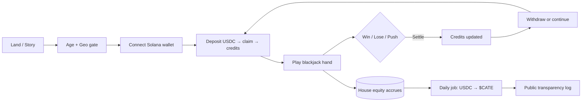
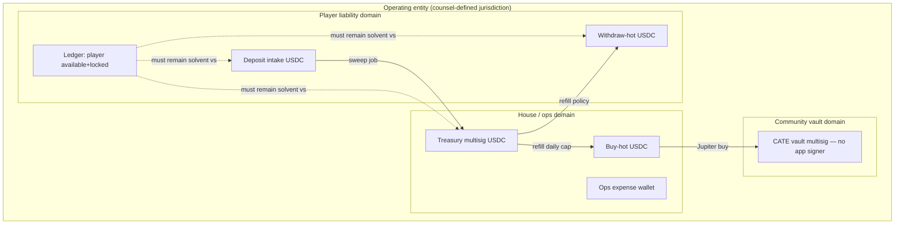
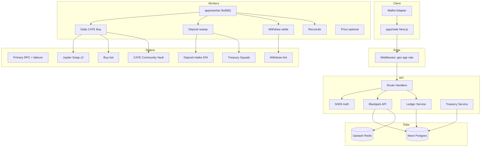
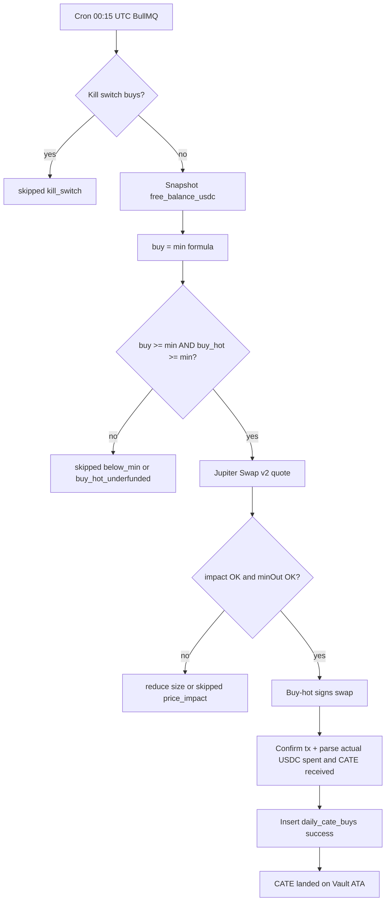
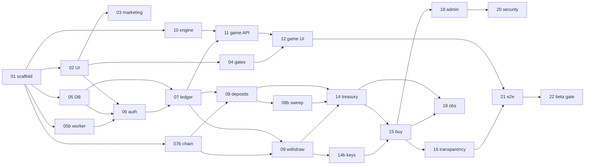

# Catesino — Community-Driven Casino for $CATE

| Field | Value |
|-------|--------|
| **Document** | Product & Technical Design (MVP → Phased Growth) |
| **Author** | Systems Architecture (draft); product DRI TBD |
| **Date** | 2026-08-11 |
| **Revised** | 2026-08-11 (Product Open Questions → v0.2.2) |
| **Status** | Draft (Rev 3 — product decisions resolved) |
| **Version** | 0.2.2 |
| **Workspace** | `C:\PersonalProject\Catesino` (greenfield monorepo target) |
| **Normative monorepo** | `apps/web`, `apps/worker`, `packages/*` (see PR 01) |
| **Related brand** | [cate.meme](https://cate.meme/) · `$CATE` Solana `Ai66LHZG9MCzg1WKdawwqduVAXpNDUuV8M3uyq5ppump` |
| **Mainnet USDC mint** | `EPjFWdd5AufqSSqeM2qN1xzybapC8G4wEGGkZwyTDt1v` (SPL Token, 6 decimals) |

### Changelog

| Version | Date | Notes |
|---------|------|--------|
| 0.1.0 | 2026-08-11 | Initial draft |
| 0.2.0 | 2026-08-11 | Review Round 1: freeze deposit path, buy-hot signer, free-balance formula, USDC-only, blackjack rules, Jupiter Swap V2, data model PKs, PR prerequisites, custody/ops depth |
| 0.2.1 | 2026-08-11 | Review Round 2: claim source-binding, liability no double-count, equity buckets for funding_source, single RNG story, USDC mint pin, deposit sweep PR, BullMQ/Upstash note, system_accounts PK |
| 0.2.2 | 2026-08-11 | Product owner: CATE hold confirmed; real-value launch (not sweepstakes); full game catalog roadmap sequenced (MVP stays blackjack-only) |

### Resolved by product (2026-08-11)

| Topic | Decision |
|-------|----------|
| **CATE disposition** | **Hold** in Community Vault (Squads multisig). Confirms Key Decision 5. Burn/LP/redistribute not default. |
| **Launch / value model** | **Real-value crypto casino** (USDC deposit/withdraw, real stakes). Not sweepstakes/points for thesis markets. Counsel + geo still **required** before public mainnet funds (`ff_public_mainnet_funds`). |
| **Post-MVP games** | **Full casino catalog** over time: higher-edge house games → more table games (roulette, video poker, …) → **poker PvP**. Sequence is ordered phases; **MVP remains blackjack only**. |

### Reversibility legend (Key Decisions)

- **R0** — reversible anytime via config/flag  
- **R1** — reversible with migration / eng work  
- **R2** — hard to reverse (brand, custody model, public claims)

---

## Overview

**Catesino** is a Solana-native, community-driven online casino whose economic loop is deliberately simple: players wager small amounts of **USDC** on fair house games; a configured share of **play-funded free treasury** is converted **once per day** into open-market **$CATE** buys; the community sees every buy (and every skip) on a public transparency ledger. The thesis is productized as:

> *Instead of throwing money away on pump.fun / FOMO for no reason, spend it on Catesino. In Catesino, we win you win. We all buy Cate.*

This document specifies product model, compliance posture as architecture constraints, UX system aligned with cate.meme’s meme-luxury aesthetic, full system architecture, on-chain treasury & daily buy design, blackjack-first game design, security, observability, rollout, risks, **Key Decisions**, and an ordered **PR Plan** for greenfield implementation.

**Opinionated MVP defaults** (frozen for implementability; product/legal Open Questions remain explicit):

| Default | Freeze |
|---------|--------|
| Currency | **USDC-only** deposits, credits, withdrawals, buy input (SOL deferred Phase 2) |
| Chain | Solana mainnet-beta (devnet for dogfood) |
| Custody | Off-chain credits + hot limited wallets + **Squads multisig** cold treasury/vault |
| Daily buy signer | **Buy-hot wallet** (capped), not unattended multi-approve Squads |
| Deposits | **Shared platform USDC ATA + claim-by-signature** |
| Free balance | **Single canonical formula** (see Economic model) |
| Swaps | **Jupiter Swap API v2** (`api.jup.ag/swap/v2`) + API key |
| Blackjack | **6-deck, S17, 3:2, no insurance/surrender/split** |
| Hosting | **Vercel (web)** + **Fly.io (worker)** + **Neon Postgres** + **Upstash Redis** + **BullMQ** |
| ORM | **Drizzle** |
| Fairness | Server-authoritative + commit–reveal |
| Compliance scaffolding | Age gate + geo deny-list + responsible-play MVP from day one |
| UX | Next.js App Router + Tailwind + Framer Motion; cate.meme sibling |

---

## Background & Motivation

### Current state

- `$CATE` is a fair-launched Solana meme token (pump.fun lineage): mint revoked, LP burned, 0% tax, strong narrative brand (“the cat sister of Dogecoin,” “The Ninth Life”).  
- cate.meme is a high-craft, scroll-story marketing site — cinematic gold/tabby aesthetic, minimal chrome, live market stats — not a product with recurring utility beyond speculation and culture.  
- Community capital currently concentrates in pure speculation (pump.fun, FOMO, Moonshot). There is no durable, transparent product sink that both entertains and creates **systematic buy pressure**.

### Pain points this product addresses

| Pain | How Catesino responds |
|------|------------------------|
| Speculative spend with no shared ritual | Daily public $CATE buys create a shared, measurable ritual |
| Distrust of crypto “casinos” (opacity, rug, unfair RNG) | Transparent treasury, public buy log, server-authoritative + auditable fairness model |
| Brand without product surface | Sibling property to cate.meme — same universe, casino extension |
| Fragmented small bets on DEXes | Small-stake entertainment with house-edge economics that fund community token demand |

### Why now

- Solana wallet UX (Phantom, Solflare) and swap aggregation (Jupiter) make crypto-only micro-stakes viable.  
- Meme communities reward narrative + transparency more than generic feature lists.  
- Empty greenfield allows correct defaults (server authority, multisig treasury, compliance scaffolding) without legacy debt.

### Workspace verification

As of 2026-08-11, `C:\PersonalProject\Catesino` has **zero files and no `.git`**. Design assumes greenfield. Normative layout for PR 01:

```text
Catesino/
  apps/
    web/          # Next.js App Router (Vercel)
    worker/       # BullMQ consumers + cron (Fly.io)
  packages/
    db/           # Drizzle schema + migrations
    ledger/       # Ledger service (pure + adapters)
    blackjack/    # Game engine (pure)
    game-protocol/# Shared types
    chain/        # Solana mints, RPC helpers, Jupiter client
    config/       # Shared env schema (zod)
  .github/workflows/
  pnpm-workspace.yaml
  package.json
  README.md
```

Initialize git in PR 01.

---

## Goals & Non-Goals

### Goals (MVP)

1. **Playable blackjack** with wallet connect, USDC deposit/withdraw credits, min/max ~$0.50–$25 USD (configurable).  
2. **House pool / platform treasury** that accumulates net player loss + house edge; **segregated** from player liability accounting.  
3. **Daily $CATE buy job** via buy-hot + Jupiter Swap v2; record **actual** on-chain amounts + tx signature.  
4. **Transparency surface**: treasury posture, buy history with funding-source tags, skip reasons, signer description, policy banner.  
5. **Brand-coherent UX**: cate.meme sibling — dark + gold, narrative copy, motion, live market bar.  
6. **Trust scaffolding**: age gate, geo deny-list, ToS/Privacy, responsible-play (self-exclude + deposit limit), rate limits, admin dual-control.  
7. **Security baseline**: no god hot wallet; buy-hot and withdraw-hot caps; multisig cold; RNG integrity.  
8. **Counsel launch gate**: no public mainnet real funds until checklist signed (PR 22).

### Goals (near-term post-MVP)

- SOL deposits (convert-to-USDC sweep)  
- **Game catalog expansion** toward full casino (see Games scope phases — not a single-lane forever)  
- First higher-edge house game(s) to support daily-buy volume  
- MPC signer (Turnkey/Fireblocks) or Squads timed policy for buys  
- Expanded transparency; Community Vault remains hold unless product reopens disposition  

### Non-Goals (explicitly out of scope for **MVP** only)

- Fiat on-ramps / card processors  
- Games beyond blackjack (roulette, video poker, slots, **poker PvP** — **post-MVP**, not abandoned)  
- Mobile native apps  
- Non-Solana chains  
- Sweepstakes / dual-currency product (product chose **real-value**; Ledger `BetContext` remains for engineering hygiene only)  
- DAO governance on-chain for day-to-day ops  
- Guaranteeing legal permissibility in all jurisdictions  
- Unattended multi-approver Squads cron for daily buys  
- SOL as play currency  

---

## Product Design

### Player loop



1. **Discover** — hero narrative + live $CATE stats.  
2. **Gate** — age + geo self-attestation + ToS.  
3. **Connect** — Phantom / Solflare / Wallet Adapter.  
4. **Fund** — send USDC to **shared deposit ATA**; submit tx signature to claim; credit after `minConfirmations`.  
5. **Play** — server-authoritative blackjack; min/max USD (= USDC 1:1).  
6. **Cash out** — withdraw to own wallet (cool-down + risk gates).  
7. **Community win** — play-funded free treasury buys $CATE daily into Community Vault.

### Economic model (house edge & contribution)

**Principle:** players pay for entertainment; **house equity** (not player liability) funds ops reserve + community buys.

#### Canonical free-balance formula (single source of truth)

All accounting is **USDC atomic units** in MVP. No multi-mint conversion in free-balance.

```text
# On-chain house assets (only these wallets, USDC balances sum):
onchain_house_usdc =
    balance(treasury_multisig_usdc_ata)
  + balance(buy_hot_usdc_ata)
  + balance(withdraw_hot_usdc_ata)
  + balance(deposit_intake_usdc_ata)   # shared deposit ATA before sweep
  # NOTE: Community Vault $CATE is NOT house USDC and does not enter free_balance

# Player liability (ledger) — balances ONLY (withdrawals table is workflow, not a second sum):
# Normative withdraw path (Option B): open withdraw keeps amount in balances.locked
# with lock_reason=withdraw. Do NOT also add withdrawals.amount into liability.
player_liability_usdc =
    sum(balances.available + balances.locked) for all users, mint=USDC

# Equity buckets (system_accounts — see funding_source section):
# house_play_equity / seed_equity / platform_equity track residual house equity sources.
# Invariant: player_liability + sum(equity buckets) + withdraw_suspense(0 in Option B)
#   ≈ onchain_house_usdc  (within pending unconfirmed deposits)

reserve_floor_usdc = config.reserveFloorUsdc   # e.g. 5000 USDC human, 6 decimals on-chain

free_balance_usdc = max(
  0,
  onchain_house_usdc - player_liability_usdc - reserve_floor_usdc
)

# Daily buy amount (USDC) from free_balance, then allocated across equity buckets:
buy_usdc = min(
  free_balance_usdc * buy_ratio,          # e.g. 0.70
  config.maxDailyBuyUsdc,                 # e.g. 10000
  balance(buy_hot_usdc_ata)               # cannot spend what buy-hot lacks
)

# Skip if buy_usdc < config.minDailyBuyUsdc (e.g. 25)
```

**Properties:**

- `reserve_floor` is subtracted **once** (inside `free_balance`). Do **not** subtract again in `buy_usdc`.  
- `buy_ratio` applies to free balance only.  
- Buy job spends **only from buy-hot**; treasury refill of buy-hot is a separate ops path.  
- If `buy_hot` underfunded relative to computed `buy_usdc`, buy **min(computed, buy_hot balance)** or **skip** with reason `buy_hot_underfunded` + P1 alert. **MVP policy:** execute `min(buy_usdc, buy_hot_balance)` if ≥ min; else skip.  
- **Never double-count liability:** open withdrawals are represented only in `balances.locked` (see Withdraw accounting).  
- **Funding source is not inferred from fungible free_balance alone** — see Equity buckets below.

#### Worked example (liability — no double-count)

| Step | User available | User locked | Open withdrawals row | `player_liability` |
|------|----------------|-------------|----------------------|--------------------|
| Deposit claim +100 | 100 | 0 | — | **100** |
| Bet 10 (stake-lock) | 90 | 10 (`hand`) | — | **100** |
| Request withdraw 20 | 70 | 30 (`hand` 10 + `withdraw` 20) | pending 20 (workflow only) | **100** (not 120) |
| Hand loses | 70 | 20 (`withdraw` only) | pending 20 | **90** |
| Withdraw sent | 70 | 0 | sent | **70** |

Wrong formula (v0.2.0) after step 3 would have been `100 + 20 = 120` — **rejected**.

#### Equity buckets & `funding_source` (implementable accounting)

USDC in treasury is fungible on-chain. Tags are honest only if the **ledger** tracks residual equity sources:

| `system_accounts.id` | Meaning | Credits when |
|----------------------|---------|--------------|
| `house_play_equity` | Net house edge + player losses − player wins (play economy) | Hand settle net to house |
| `seed_equity` | Founder/treasury seed float | Ops records `contribution` kind with `funding_source=seed` after on-chain refill |
| `platform_equity` | Explicit platform subsidy for buys | Platform contribution job credits this (and may move USDC to buy-hot) |
| `fees` | Optional fee income | Side fees later |
| `withdraw_suspense` | **Unused in MVP Option B** (reserved if pivoting to Option A) | — |

**Buy waterfall (normative MVP):** when executing a free_balance-funded buy of size `B` from buy-hot:

```text
remaining = B
draw from house_play_equity first → tag portion play
then seed_equity → tag portion seed
then platform_equity → tag portion platform
debit equity buckets accordingly (ledger entries)
```

- If a single on-chain swap uses multiple buckets, either (a) **split into multiple `daily_cate_buys` child rows** sharing `business_date` + parent id, or (b) one parent row with `funding_source=mixed` + `route_json.allocation[{source, amount}]` and transparency UI expands allocation. **MVP pick: (b) parent + allocation JSON**; cumulative metrics sum allocation amounts by source.  
- **Platform-only ritual buy** (no free_balance): separate job path `runPlatformContributionBuy` — moves ops USDC to buy-hot (or spends platform_equity already on buy-hot), inserts row with `funding_source=platform` only; **does not** call free_balance inference.  
- **Remove** any `inferredFundingSource` from free_balance snapshot alone.

#### Deprecated / removed formulas

The earlier draft’s `eligible = deposits_settled + net_game_loss - ...` is **removed**. Edge and net losses flow into `house_play_equity` via settlement ledger entries; do not double-count with a second cashflow formula.

#### Parameter defaults

| Parameter | MVP default | Notes |
|-----------|-------------|--------|
| Game | Blackjack 6D S17 | Natural edge ~0.5% basic strategy |
| Min bet | $0.50 USDC | Config |
| Max bet | $25 USDC or risk table | Also ≤ 1% of free+reserve conservative cap later |
| Buy ratio | 0.70 of free_balance | R0 config |
| Reserve floor | $5,000 USDC | Raise before public scale |
| Max daily buy | $10,000 USDC | Liquidity guard |
| Min daily buy | $25 USDC | Avoid dust ritual failure messaging |
| Daily buy window | 00:15 UTC | Idempotent `business_date` |
| Buy input mint | USDC only | Frozen MVP |

#### Unit economics (stress, not a promise)

Assumptions: house edge realized ≈ **1.0%** of handle early (mix of suboptimal play; **0.5%** if all basic strategy). Min meaningful buy = **$25**.

| Realized edge | Daily handle needed for $25 edge | Notes |
|---------------|----------------------------------|--------|
| 0.5% | $5,000 | Tough for tiny community day-one |
| 1.0% | $2,500 | Still material volume |
| 2.0% | $1,250 | Needs higher-edge games or worse play |

**Implications:**

1. Early daily buys will often be **seed-subsidized** or **skipped** — transparency must show `skipped` / `seed` honestly (brand risk of empty ritual).  
2. MVP may include a **platform contribution** line item (ops wallet → buy-hot, tagged `funding_source=platform`) separate from free_balance formula.  
3. Phase 2 **will** add **≥1 higher-edge house game** (e.g. dice/coin) as the first step of the full-catalog roadmap and to support the daily-buy ritual — not a permanent single-game product.  
4. “70% of free balance” does **not** create buy volume from deposits alone: deposits increase both assets and liability net-zero until play settles.

### Transparency model (“daily buy $CATE”)

Public claims must be **falsifiable**:

1. Public addresses: deposit intake, withdraw-hot (optional display), treasury multisig, buy-hot, community vault.  
2. Every buy row: date, input USDC (**actual** parsed from chain), CATE received (**actual**), tx sig, explorer URL, **funding_source** (`play` \| `seed` \| `platform`), route summary.  
3. Every skip row within **1 hour** of cron: reason enum public.  
4. Policy text: ratio, reserve floor, last policy change banner (N days).  
5. **Signer set description** (e.g. “3-of-5 Squads; members are ops — not a community DAO”).  
6. Never claim “cannot sell” unless burn/locked program; default is “multisig hold; sell requires multi-party + public policy change.”

### Games scope

**Product intent (2026-08-11):** build toward a **full casino catalog** (house games + eventually PvP poker). **MVP ships blackjack only** — no scope expansion in PR 01–22.

| Phase | Games | Notes |
|-------|--------|------|
| **MVP** | **Blackjack only** | Frozen ruleset below; server-authoritative house game |
| **Phase 2** | **Higher-edge house games** first (e.g. dice, coin flip, simple crash-style) | Buy-volume + catalog start; still `GameEngine` house model |
| **Phase 3** | **More table / house games** (roulette, video poker, additional blackjack variants, themed house games) | Expand felt catalog; still vs house |
| **Phase 4** | **Poker PvP** (e.g. Texas Hold’em) + further catalog (slots, seasonal) | Matching, rake, collusion, disconnect rules — separate trust model |
| **Later** | Remaining “all casino games” surface as capacity allows | Prioritize by ops, compliance, and edge/volume |

**Sequence (normative):** higher-edge house → more table/house games → poker PvP. Do not jump to poker before house catalog depth without a deliberate product change.

Architecture foreshadow: keep `GameEngine` / `LedgerService` / `BetContext` so new house games plug in without rewriting custody; poker gets its own package and table service in Phase 4.

### What happens to bought $CATE?

**Product decision (2026-08-11) — confirmed:** **Hold** in **Community Vault** (Squads multisig). Destination of every buy = vault’s CATE ATA. **No sell key material in app or buy-hot.** Vault signers cannot be exercised by the worker process. Open Question #1 **resolved**.

| Option | Status |
|--------|--------|
| **Hold in vault** | **Chosen default** |
| Burn | Not default; requires new product + policy change |
| Add LP | Not default |
| Redistribute | Not default (compliance heat) |
| Grants pot | Not default |

---

## Legal / Compliance Posture (Architecture Constraints)

> **Not legal advice.** Real-value crypto wagering is high regulatory heat. Counsel before public mainnet funds.

### Launch posture (product-resolved)

**Real-value crypto casino** for thesis markets: USDC in/out, real stakes, real withdraws. **Not** a sweepstakes or play-for-fun-only pivot as the primary strategy (Open Question #3 **resolved** 2026-08-11).  

**Unchanged architecture constraints:** age/geo scaffolding, counsel checklist, and `ff_public_mainnet_funds` still gate public mainnet player funds. Real-value increases compliance heat; it does not remove geo deny-lists or entity work.

### Risk class

Staking crypto for a chance at more crypto is treated as **gambling** in many jurisdictions. Exposure includes civil/criminal risk, hosting takedowns, and ad-channel bans.

### Entity & funds segregation (system constraint)



**Architecture rules:**

1. **Player liability** is a first-class ledger total; never spend player liability on CATE buys (enforced by free_balance formula).  
2. **Ops expenses** pay from ops wallet, not deposit intake directly.  
3. **Community Vault CATE** is not player-redeemable and not house USDC.  
4. **Bank/fiat** (if any later) stays outside MVP; if entity holds fiat, counsel defines segregation — out of MVP scope.  
5. Launch gate: **no public mainnet with real player funds** until counsel checklist in PR 22 is signed (entity, ToS, geo list, marketing claims).

### AML / sanctions posture (MVP decision)

| Item | MVP posture |
|------|-------------|
| KYC | **None** at MVP (counsel-gated escalation) |
| Sanctions screening | **None automated** at MVP; geo deny-list + ToS only |
| Recordkeeping | Retain wallet, deposit/withdraw txs, hand outcomes ≥ counsel-required period (default **2 years** config) |
| Trigger to add KYC/AML | Counsel, payment partner, or volume threshold |

This is an explicit **accept residual risk** decision for private beta; not a claim of compliance.

### Age, geo, marketing

1. **Age gate** — default 18+ (config 21+); store ack timestamp + wallet + IP hash.  
2. **Geo** — deny-list mode; list is **counsel-owned** config; self-attestation required.  
3. **Disclaimers** — entertainment; house edge; loss of stake; $CATE market risk independent of game outcomes.  
4. **Marketing claims** — hero phrase “We all buy Cate” is **flag-gated** (`ff_marketing_thesis_claims`). Default **off** on public production until counsel review. Landing can ship narrative without promising investment returns. Avoid “guaranteed buy pressure → price” language.  
5. **ToS / Privacy / Responsible play** pages from PR 03; counsel review before unflagging real funds.

### Responsible play (MVP minimum)

| Control | MVP |
|---------|-----|
| Self-exclusion | Wallet flag `self_excluded_until`; revoke sessions; block login play/deposit/withdraw |
| Deposit limit | Optional daily deposit cap per wallet (config default **$100/day**, user can set lower) |
| Session reminder | Soft UI timer after 60 minutes continuous play (no hard force-logout MVP) |
| Loss limit | Phase 2 |
| Reality checks | Phase 2 |

Self-exclusion enforcement surface: **wallet pubkey primary**; session revoke all; optional IP hash denylist for 24h soft friction (not reliable alone).

### Sweepstakes / dual-currency pivot (honest scope)

**MVP ships real-value USDC only** (product-confirmed launch posture). A full sweepstakes model is **not** planned as the primary product and is **not** a Ledger rename if ever forced by counsel:

| Required for pivot | LedgerService alone? |
|--------------------|----------------------|
| Dual balances (playable gold vs redeemable sweeps) | Needs schema: multiple `balance_kinds` or mints |
| Purchase / earn rules for each currency | Product + API rewrite |
| Redemption KYC / eligibility | New services |
| Separate game stake currency rules | Game bet context changes |
| Marketing / geo package | Full compliance redesign |

**What we still do:** games call `LedgerService.lock/stake/payout` with a `BetContext { currency, kind }` so engine code is not littered with raw USDC assumptions. That reduces rewrite cost; it does **not** make pivot “free.”

### Kill switches

Within minutes: pause games, pause deposits, pause withdrawals, pause buys independently (`ff_*` + admin API + config_kv).

---

## UX / UI Design System (cate.meme sibling)

### Brand principles

- **Meme-luxury, not neon Vegas** — warm gold, tabby browns, deep ink, cream text.  
- **Narrative over chrome** — microcopy in Laws / table voice.  
- **Cinematic motion** — Framer Motion restrained; honor `prefers-reduced-motion`.  
- **Sibling, not clone** — cate.meme is story scroll; Catesino is product framed by story.

### Design tokens

```css
:root {
  --bg-void: #0a0806;
  --bg-raised: #14100c;
  --bg-felt: #1a120c;
  --stroke-subtle: rgba(212, 175, 100, 0.18);
  --stroke-strong: rgba(232, 196, 120, 0.45);

  --gold-100: #f5e6c8;
  --gold-300: #e8c478;
  --gold-500: #d4af64;
  --gold-700: #a67c3d;

  --text-primary: #f3efe6;
  --text-muted: rgba(243, 239, 230, 0.62);

  --win: #7dcea0;
  --lose: #c97b7b;
  --warning: #e0b45a;
  --focus-ring: #e8c478;

  /* Spacing scale (px) */
  --space-1: 4px;
  --space-2: 8px;
  --space-3: 12px;
  --space-4: 16px;
  --space-5: 24px;
  --space-6: 32px;
  --space-8: 48px;
  --space-12: 64px;

  /* Radius */
  --radius-sm: 6px;
  --radius-md: 12px;
  --radius-lg: 20px;
  --radius-pill: 999px;

  --font-display: "Cormorant Garamond", "Times New Roman", serif;
  --font-body: "DM Sans", "Inter", system-ui, sans-serif;
  --font-mono: "JetBrains Mono", ui-monospace, monospace;
}
```

**Fonts note:** Cormorant + DM Sans are a **sibling choice** for meme-luxury (serif display + clean body). cate.meme’s exact loaded faces are not required to match byte-for-byte; sample golds from live site during PR 02 visual QA.

### Breakpoints

| Token | Width | Use |
|-------|-------|-----|
| `sm` | 640px | Mobile+ |
| `md` | 768px | Tablet rail collapse |
| `lg` | 1024px | Full felt + side rail |
| `xl` | 1280px | Marketing wide |

### Motion

- Page enter: fade + 12–20px Y, 400–600ms.  
- Chip select: spring; bet confirm: gold pulse.  
- Card deal: stagger 40–80ms.  
- `prefers-reduced-motion: reduce` → opacity-only, no 3D flips.

### Accessibility

- Focus visible: 2px `var(--focus-ring)` offset on all interactive controls.  
- Contrast: body text on void ≥ WCAG AA; muted text not used for primary actions.  
- Gates/modals: focus trap, Esc to close only where legally allowed (age gate cannot dismiss without choice).  
- Game actions: keyboard-operable Hit/Stand/Double.

### Component inventory (MVP checklist)

| Component | Notes |
|-----------|--------|
| `Button` | primary gold / ghost / danger |
| `Modal` | gates, confirm withdraw |
| `AgeGate` / `GeoGate` | first-run |
| `ConnectButton` | wallet adapter |
| `MarketStatsBar` | sticky |
| `Chip` | denominations below |
| `BetPanel` | +/−, max, clear |
| `CardFace` / `CardBack` | asset strategy below |
| `FeltStage` | table surface |
| `HandSeats` | player/dealer rows |
| `BalancePill` | available + locked |
| `FairnessBadge` | hash + verify link |
| `TransparencyTable` | buys + skips |
| `EmptyState` / `ErrorState` / `Skeleton` | all data views |
| `AdminKillSwitch` | ops |

### Card & chip assets

| Asset | MVP strategy |
|-------|----------------|
| Card faces | **SVG component set** (suit + rank); gold/cream on dark; no third-party license ambiguity |
| Card back | Brand “C” monogram on void |
| Chips | CSS/SVG chips; denominations **$0.50, $1, $5, $25** (USDC) |
| Sounds | Optional off by default |

### Bet control UX

1. Select chip denomination → click felt or “Add bet”.  
2. `Clear` / `Rebet` after hand.  
3. Disable actions while `phase !== player_turn`.  
4. Show min/max and balance; error toast if insufficient.

### Felt wireframe (reference)

```text
+--------------------------------------------------+
| [Stats bar: mcap price liq holders]    [Connect] |
+--------------------------------------------------+
|  CATESINO          Play  Transparency  Laws      |
+--------------------------------------------------+
|                                                  |
|              [ Dealer: cards ]                   |
|                  (hole card)                     |
|                                                  |
|                 ~ felt gold ~                    |
|                                                  |
|              [ Player: cards ]                   |
|         bet: $1.00    balance: $42.00            |
|                                                  |
|     ($0.5) ($1) ($5) ($25)   [Clear] [Deal]      |
|     [Hit] [Stand] [Double]     fairness: ab12…   |
+--------------------------------------------------+
```

### Key pages

| Route | Purpose |
|-------|---------|
| `/` | Marketing; claims flag-sensitive |
| `/play/blackjack` | Game |
| `/transparency` | Buys, skips, policy, signers |
| `/account` | Balances, history, limits, self-exclude |
| `/laws` | Rules, fairness, edge disclosure |
| `/legal/*` | Terms, privacy, responsible play |
| `/admin` | Ops |
| `/status` | Public degraded status (buy skip banner optional) |

### Content voice

> *Eight lives were story. This table is the ninth — and every chip that falls buys Cate for us all.*

(Thesis claims remain feature-flagged for counsel.)

---

## Proposed Architecture

### High-level system



### Hosting freeze (MVP)

| Layer | Choice | Rationale |
|-------|--------|-----------|
| Web/API | **Vercel** (Next.js) | SSR marketing + BFF; no long cron |
| Workers | **Fly.io** `apps/worker` | Long-running BullMQ + cron; not serverless timeouts |
| Postgres | **Neon** | Managed, branching for PR previews |
| Redis | **Upstash** (BullMQ-compatible plan) | Locks + queues; see PR 05b compatibility note |
| Jobs | **BullMQ** on Fly worker | Explicit retries; daily buy reliability; fallback **Fly Redis** if Upstash blocking semantics fail CI smoke |
| ORM | **Drizzle** | Lightweight, SQL-transparent for ledger |
| Secrets | **Doppler** or Fly/Vercel secret stores | No git secrets |
| RPC | **Helius** primary + second provider failover | Deposit verify |
| Errors | **Sentry** | Web + worker |
| Logs/metrics | Structured JSON → Axiom or Grafana Cloud | P1 alerts |

### Component responsibilities

| Component | Responsibility |
|-----------|----------------|
| `apps/web` | UI, BFF route handlers, SIWS |
| `apps/worker` | Buy, sweep, withdraw, reconcile, optional price |
| `packages/blackjack` | Pure engine |
| `packages/ledger` | Balances, locks, idempotent entries |
| `packages/chain` | Mints, Jupiter v2 client, tx parse |
| `packages/db` | Drizzle schema/migrations |

### Sequence: deposit claim → play → daily buy

```mermaid
sequenceDiagram
  participant U as Player
  participant W as Wallet
  participant API as BFF
  participant L as Ledger
  G as Game
  participant DB as Postgres
  participant Wr as Worker
  participant Sol as Solana
  participant J as Jupiter v2

  U->>W: Connect + SIWS
  U->>Sol: Transfer USDC to shared deposit ATA
  U->>API: POST claim { txSignature }
  API->>Sol: Verify tx + confirmations
  API->>L: Credit USDC (idempotent)
  U->>G: Create hand + bet
  G->>DB: Lock bet + deal
  G->>U: Actions until settle
  G->>L: Payout or loss
  Note over Wr,J: 00:15 UTC
  Wr->>DB: free_balance formula
  Wr->>J: quote + swap v2
  Wr->>Sol: Buy-hot signs; CATE to vault ATA
  Wr->>Sol: Confirm + parse actual amounts
  Wr->>DB: daily_cate_buys success row
```

---

## Tech Stack Recommendation

| Layer | Choice | Rationale |
|-------|--------|-----------|
| Language | TypeScript | Shared protocol types |
| Web | Next.js 15 App Router, React, Tailwind, Framer Motion | Brand motion + SSR |
| Worker | Node on Fly + BullMQ | Reliable cron |
| Wallet | `@solana/wallet-adapter-react` | Ecosystem default |
| Solana | `@solana/web3.js` or `@solana/kit` | No Anchor program MVP |
| Swaps | **Jupiter Swap API v2** + `x-api-key` | Ultra is legacy/unmaintained for new integrators |
| DB | Neon Postgres + **Drizzle** | Ledger integrity |
| Cache | Upstash Redis | Nonce, locks, BullMQ |
| Auth | SIWS + httpOnly cookie | Wallet-native |
| Testing | Vitest + Playwright | Engine golden vectors |
| CI | GitHub Actions | lint/typecheck/test |

**Custom on-chain program:** none in MVP.

---

## API / Interface Changes

### Auth (operational detail)

```http
POST /api/auth/nonce
→ { nonce: string, expiresAt: string }
```

- Nonce stored in **Redis** key `siws:nonce:{nonce}` TTL **5 minutes**, **one-time use** (GETDEL on verify).  
- SIWS message **domain-bound** to `CATESINO_AUTH_DOMAIN` (e.g. `catesino.example`), includes chain id, issued-at, expiration, nonce.  
- Reject if ` Domains` mismatch or clock skew > 60s.

```http
POST /api/auth/verify
Body: { publicKey, signature, message, nonce }
→ Set-Cookie: session=...; HttpOnly; Secure; SameSite=Lax; Path=/
```

- Session: sealed JWT or iron-session; store **`session_token_hash`** (SHA-256) in `sessions` table.  
- **Absolute TTL:** 7 days; **idle TTL:** 24 hours (sliding on API use).  
- **Max concurrent sessions** per wallet: 5 (evict oldest).  
- Mutating routes: require `Origin` / `Host` check allowlist; `SameSite=Lax` + origin check (not CSRF token MVP).

### Ledger

```http
GET /api/me/balances
→ { usdc: string, locked: string }

GET /api/me/deposits/instructions
→ { depositAddress, mint: USDC, minAmount, minConfirmations, cluster }

POST /api/me/deposits/claim
Headers: Idempotency-Key: ...
Body: { txSignature: string }
→ { depositId, amount, status }

POST /api/me/withdrawals
Headers: Idempotency-Key: ...
Body: { amount: string }
→ { withdrawalId, status: "pending", availableAt? }

GET /api/me/transactions?cursor=
```

### Blackjack

```http
POST /api/games/blackjack/hands
Headers: Idempotency-Key: ...
Body: { betAmount: string }
→ { handId, phase, playerCards, dealerCards, fairness: { serverSeedHash, clientSeed, nonce, shoeId } }

POST /api/games/blackjack/hands/:id/actions
Headers: Idempotency-Key: ...
Body: { action: "hit" | "stand" | "double" }
→ { state..., outcome? }

GET /api/games/blackjack/hands/:id
→ full state; serverSeed only if settled
```

**Transport:** HTTP request/response only in MVP. Client **polls** `GET hand` every **1.5s** while `phase` is non-terminal if needed; prefer action responses as source of truth. SSE/WebSocket = Phase 2.

**Dealer cards:** on deal, return dealer **upcard only** (`dealerCards: [upcard]`, `holeHidden: true`). After player terminal, dealer play then reveal hole; full cards on settle. **Peek:** if upcard Ace or 10-value, server peeks hole for dealer BJ before player acts; if dealer BJ, hand settles immediately (player loses bet unless player BJ → push).

### Transparency (public)

```http
GET /api/public/treasury
→ {
  policy, reserveFloorUsdc, buyRatio,
  addresses: { deposit, treasury, buyHot, vault },
  signerDescription,
  policyChangedAt, lastBuyAt, lastSkipAt
}

GET /api/public/buys?limit=30
→ [{ businessDate, status, fundingSource, inputUsdcActual, cateAmountActual,
     txSignature, explorerUrl, skipReason }]

GET /api/public/stats
→ { cumulativeCateBoughtPlay, cumulativeCateBoughtSeed, cumulativeCateBoughtPlatform, handsPlayed24h }
```

### Admin

```http
POST /api/admin/kill-switch
PATCH /api/admin/config
GET /api/admin/withdrawals?status=
POST /api/admin/withdrawals/:id/approve   # dual-control if amount >= threshold
POST /api/admin/withdrawals/:id/reject
```

### Shared protocol (MVP — no split)

```ts
export type BlackjackAction = "hit" | "stand" | "double";

export type HandPhase =
  | "player_turn"
  | "dealer_turn"
  | "settled"
  | "void";

export interface FairnessCommit {
  serverSeedHash: string;
  clientSeed: string;
  nonce: number;
  shoeId: string;
}
```

---

## Data Model Changes

### Core tables (Postgres / Drizzle)

```text
users
  id uuid PK
  wallet_pubkey text UNIQUE NOT NULL
  created_at timestamptz
  age_acknowledged_at timestamptz NULL
  geo_ack_at timestamptz NULL
  self_excluded_until timestamptz NULL
  daily_deposit_limit_usdc numeric(36,6) NULL
  role text DEFAULT 'player'  -- player|admin

sessions
  id uuid PK
  user_id uuid FK
  session_token_hash text NOT NULL UNIQUE
  created_at, last_seen_at, expires_at timestamptz
  ip_hash, user_agent_hash text

balances
  user_id uuid NOT NULL
  mint text NOT NULL  -- 'USDC' only in MVP
  available numeric(36,6) NOT NULL DEFAULT 0
  locked numeric(36,6) NOT NULL DEFAULT 0
  updated_at timestamptz
  PRIMARY KEY (user_id, mint)
  CHECK (available >= 0 AND locked >= 0)

-- System / house accounts (no null user_id hacks)
system_accounts
  id text NOT NULL
    -- enum: house_play_equity | seed_equity | platform_equity | fees | withdraw_suspense
  mint text NOT NULL  -- 'USDC' in MVP
  balance numeric(36,6) NOT NULL DEFAULT 0
  PRIMARY KEY (id, mint)

balances also gains (or separate lock table):
  -- optional: lock breakdown via ledger kinds; MVP may use
  -- balances_locks (user_id, mint, reason, ref_id, amount) for hand vs withdraw
  -- OR encode lock_reason only in open withdrawals + open hands queries.
  -- Normative: sum(balances.locked) == sum(open hand locks) + sum(open withdraw amounts)

ledger_entries
  id uuid PK
  account_kind text NOT NULL  -- 'user' | 'system'
  user_id uuid NULL           -- required if account_kind=user
  system_account_id text NULL -- required if account_kind=system
  mint text NOT NULL
  amount numeric(36,6) NOT NULL  -- signed from account perspective
  kind text NOT NULL
  ref_type text NOT NULL
  ref_id text NOT NULL
  idempotency_key text UNIQUE  -- preferred idempotency
  created_at timestamptz
  -- Partial unique indexes instead of NULL-broken UNIQUE:
  -- UNIQUE (kind, ref_type, ref_id, user_id, mint) WHERE user_id IS NOT NULL
  -- UNIQUE (kind, ref_type, ref_id, system_account_id, mint) WHERE system_account_id IS NOT NULL
  CHECK (
    (account_kind = 'user' AND user_id IS NOT NULL AND system_account_id IS NULL)
    OR (account_kind = 'system' AND system_account_id IS NOT NULL AND user_id IS NULL)
  )

deposits
  id uuid PK
  user_id uuid NOT NULL
  tx_signature text NOT NULL UNIQUE
  mint text NOT NULL
  amount numeric(36,6) NOT NULL
  status text NOT NULL  -- observed|confirmed|credited|reorged|rejected
  slot bigint NULL
  confirmations int NOT NULL DEFAULT 0
  credited_at timestamptz NULL
  created_at timestamptz

-- MVP shared address still recorded for audit (single row config);
-- table supports future per-user addresses without redesign
deposit_addresses
  id uuid PK
  user_id uuid NULL          -- NULL = shared platform address
  mint text NOT NULL
  address text NOT NULL
  derivation_path text NULL  -- unused in shared MVP
  active boolean NOT NULL DEFAULT true
  created_at timestamptz
  UNIQUE (address, mint)

withdrawals
  id uuid PK
  user_id uuid NOT NULL
  mint text NOT NULL
  amount numeric(36,6) NOT NULL
  status text NOT NULL
    -- pending|approved|sending|sent|failed|rejected
  destination_pubkey text NOT NULL
  tx_signature text NULL
  failure_reason text NULL
  idempotency_key text UNIQUE
  reviewed_by uuid NULL
  dual_approved_by uuid NULL  -- second admin if required
  available_at timestamptz NULL  -- cool-down gate
  created_at, updated_at timestamptz

blackjack_hands
  id uuid PK
  user_id uuid NOT NULL
  bet_amount numeric(36,6) NOT NULL
  mint text NOT NULL DEFAULT 'USDC'
  phase text NOT NULL
  player_cards jsonb NOT NULL
  dealer_cards jsonb NOT NULL
  hole_hidden boolean NOT NULL DEFAULT true
  actions jsonb NOT NULL DEFAULT '[]'
  outcome text NULL  -- win|lose|push|blackjack|bust|dealer_blackjack
  payout_amount numeric(36,6) NULL
  server_seed_hash text NOT NULL
  server_seed text NULL  -- ONLY populated at settle; column-level access discipline
  client_seed text NOT NULL
  nonce int NOT NULL
  shoe_id uuid NOT NULL
  created_at, settled_at timestamptz

-- Admin API MUST use projection that excludes server_seed WHERE settled_at IS NULL
-- Prefer separate fairness_reveals table post-MVP if needed; MVP: query discipline + tests

daily_cate_buys
  id uuid PK
  business_date date NOT NULL UNIQUE
  status text NOT NULL  -- pending|success|failed|skipped
  funding_source text NOT NULL  -- play|seed|platform|mixed
  -- when mixed, route_json.allocation[] holds per-source amounts
  input_mint text NOT NULL DEFAULT 'USDC'
  input_amount_requested numeric(36,6) NULL
  input_amount_actual numeric(36,6) NULL
  cate_amount_actual numeric(36,6) NULL
  tx_signature text UNIQUE NULL
  route_json jsonb NULL
  skip_reason text NULL
  price_impact_bps int NULL
  created_at timestamptz

treasury_snapshots
  id uuid PK
  taken_at timestamptz
  onchain_house_usdc numeric(36,6)
  player_liability_usdc numeric(36,6)
  reserve_floor_usdc numeric(36,6)
  free_balance_usdc numeric(36,6)
  wallet_balances jsonb  -- per-address breakdown

config_kv
  key text PK
  value jsonb NOT NULL
  updated_at timestamptz
  updated_by text NULL

audit_log
  id uuid PK
  actor text NOT NULL
  action text NOT NULL
  payload jsonb
  created_at timestamptz
```

### Ledger invariant

```text
player_liability_usdc + sum(system_accounts.balance for equity ids)
  ≈ onchain_house_usdc
  within pending_unconfirmed_deposits tolerance

# player_liability_usdc = sum(available + locked) only — never + open withdrawals
```

Nightly + hourly reconcile; **P1** if `|drift| > max($10, 0.1% of player_liability)`.

### Deposit finality & reorg

1. Claim verifies tx: correct mint, destination = deposit address, amount ≥ min dust (**1 USDC** default), not already credited.  
2. Status `observed` → wait **`minConfirmations = 32`** (config) → `confirmed` → credit → `credited`.  
3. If reorg detected before credit: mark `reorged`, never credit.  
4. If reorg after credit within reorg watch window (same slot depth policy): **reverse ledger entry** (`kind=deposit_reorg_reversal`), freeze user withdraws until balance non-negative resolution; P1 alert. (Rare on Solana at 32 conf; still designed.)

### Migration strategy

Drizzle migrations from PR 05; expand/contract; numeric money; idempotency keys on all external effects.

---

## On-Chain Design

### Addresses & roles

| Wallet | Purpose | Key management | App access |
|--------|---------|----------------|------------|
| **Deposit intake** | Shared USDC ATA receive | May be hot or multisig-owned ATA | Worker sweep only |
| **Withdraw-hot** | Auto withdrawals under cap | Hot key in **worker secret store only** (Fly secrets / KMS) | Withdraw worker |
| **Buy-hot** | Daily USDC → CATE | Separate hot key; **max balance = maxDailyBuy + dust** | Buy worker |
| **Treasury multisig** | Bulk USDC cold | **Squads** m-of-n | No app auto-sign |
| **CATE Community Vault** | Hold bought CATE | **Squads** (can be same or different set) | **No sell path in app** |

### Chain constants (pinned)

| Cluster | USDC mint | Decimals | Notes |
|---------|-----------|----------|--------|
| **mainnet-beta** | `EPjFWdd5AufqSSqeM2qN1xzybapC8G4wEGGkZwyTDt1v` | 6 | **Only** allowlisted USDC (classic SPL Token mint). Reject bridged/other “USDC” mints. |
| **devnet** | `4zMMC9srt5Ri5X14GAgXhaHii3GnPAEERYPJgZJDncDU` | 6 | Circle devnet USDC (confirm in PR 07b if faucet mint changes; single source in `packages/chain`) |

| Constant | Rule |
|----------|------|
| `$CATE` mint | `Ai66LHZG9MCzg1WKdawwqduVAXpNDUuV8M3uyq5ppump` |
| Deposit intake | **ATA** of `(DEPOSIT_OWNER_PUBKEY, USDC_MINT)` — never an arbitrary token account; derive with associated token program |
| `DEPOSIT_OWNER_PUBKEY` | Set at key ceremony (PR 14b); placeholder in config until then |
| Claim mint check | `mint == allowlisted USDC for cluster` else reject |

### Deposit path (FROZEN MVP)

**Shared platform USDC ATA + claim-by-signature.**

1. `GET /api/me/deposits/instructions` returns derived deposit ATA + USDC mint + min amount + cluster.  
2. User transfers USDC (SPL `Transfer` / `TransferChecked`) to that ATA.  
3. User `POST claim` with `txSignature` (authenticated session).  
4. Server verifies via RPC (primary + **secondary RPC** if amount ≥ **$50**). **All** of the following must hold or reject:  
   1. Transaction **succeeded** (`meta.err == null`).  
   2. **Mint** is allowlisted USDC for cluster.  
   3. **Destination** token account == platform deposit ATA (derived).  
   4. **Amount** ≥ `minDepositUsdc`.  
   5. **Source binding (anti-theft):** the **authority/owner of the source token account** that debited USDC equals the authenticated session’s `wallet_pubkey`.  
      - Parse Token Program and Token-2022 `Transfer` / `TransferChecked` instructions (and any inner ixs).  
      - **Fee payer is not sufficient** — many wallets pay fees from the same wallet, but credit must bind to **token authority / source owner**, not merely any signature on the tx.  
      - If multiple USDC transfers to deposit ATA exist in one tx, sum only transfers whose source owner == session wallet; ignore others.  
   6. `tx_signature` not already credited (idempotent unique).  
   7. Confirmations ≥ `minConfirmations` (32).  
5. Credit after confirmations; ledger `deposit` entry.

**Required PR 08 tests:** double-claim same sig; **wallet A pays, wallet B session cannot claim** (adversarial); wrong mint; wrong dest; amount below min; fee-payer ≠ source owner edge case.

**Why not per-user HD in MVP:** faster ship, simpler ops; accept support load of “wrong account / no claim.” Phase 2: Helius webhook + optional per-user addresses.

**Schema:** `deposit_addresses` holds the shared row (`user_id NULL`, `address` = ATA string).

**Dust / min deposit:** 1 USDC. Below min → `rejected`, no credit.

### Deposit sweep job (normative)

Deposit intake is a **receive** wallet; free_balance includes it, but ops expect funds to land in treasury.

| Item | Spec |
|------|------|
| Worker | `apps/worker` job `sweep-deposits` (BullMQ repeatable, e.g. every 5–15 min) |
| Action | Transfer USDC from deposit intake ATA → treasury multisig USDC ATA |
| Min sweep | e.g. **$50** or leave **$5** dust for rent/fees (config) |
| Signer | Deposit-owner hot key **or** intake is an ATA of a limited hot “intake” key (not withdraw/buy keys) |
| Kill switch | Honor `ff_deposits_usdc` / ops `sweep` pause |
| Metrics | `deposit.unswept_balance`, `deposit.unswept_age_seconds`; **P2** if age > 2h and bal > min |
| Manual fallback | Runbook: CLI/Squads transfer intake → treasury if worker down |
| PR | **PR 08b** (or acceptance criteria on PR 08 + worker) — see PR Plan |

### Withdrawals

**Accounting path (Option B — normative):**

1. Request: `available -= amt; locked += amt` (lock_reason=`withdraw`); insert `withdrawals` row `pending`.  
   - **Liability unchanged** except composition (still in `balances.*`). Do **not** add `withdrawals.amount` again into `player_liability`.  
2. Set `available_at = now + cool_down`.  
3. **First withdraw** on a wallet: **24h cool-down**. Subsequent: **0–15 min** config (default 0 after first).  
4. Risk: velocity, new account, amount ≥ **$100** → manual `approved` required.  
5. Amount ≥ **$500** → **dual admin approve** (`reviewed_by` ≠ `dual_approved_by`).  
6. Worker: status `sending` → simulate → send → confirm → `sent`: then `locked -= amt` (funds left the platform). On chain failure → `failed`, unlock back to `available` (or keep locked for retry — config; default unlock to available and mark failed).  
7. Destination **must equal** user’s authenticated wallet pubkey (no third-party dest in MVP).  
8. Rejected: `locked -= amt; available += amt`.

### Hot wallet policy (withdraw-hot & buy-hot)

| Rule | Withdraw-hot | Buy-hot |
|------|--------------|---------|
| Max balance | ≤ **24h expected withdraw + 20% buffer**, hard cap config e.g. **$2,000** | ≤ **`maxDailyBuyUsdc` + $10** |
| Per-tx cap | e.g. **$200** | entire daily buy up to max |
| Daily outflow cap | e.g. **$5,000** | 1 successful buy/day (+ manual retry) |
| Excess | Auto-sweep to treasury multisig when balance > cap | Do not pre-load multi-day funds |
| Destination allowlist | Withdrawal record dest only | Jupiter program + vault CATE ATA only |
| Simulation | Required before send | Required before send |
| Alert | Balance > cap; unknown dest attempt | Underfunded at cron; balance > cap |
| Key storage | Fly secret / KMS; **not** Vercel env | Same; **never** in web app |
| Rotate | Runbook: drain → new key → update secret → audit | Same |

**Emergency rotate:** documented in `docs/runbooks/key-rotation.md` (PR 14b before beta).

### Daily $CATE buy execution (FROZEN MVP signer path)



**Key Decision freeze:**

- **MVP:** Buy-hot wallet signs unattended daily swap; funds only that day’s cap; CATE destination = Community Vault ATA.  
- **Treasury Squads:** manual or semi-auto **refill** of buy-hot (and withdraw-hot) — not in the cron critical path.  
- **Post-MVP:** Turnkey/Fireblocks MPC or Squads spending policy / timelock.  
- **Vault:** no worker key; cannot sell via app.

**If buy-hot underfunded:** skip or partial per Economic model; **P1** + refill runbook.

### Jupiter Swap API v2 (pinned)

- **Base:** `https://api.jup.ag/swap/v2` (order/execute or quote+swap build per current v2 docs).  
- **Auth:** `x-api-key: $JUPITER_API_KEY` (secret).  
- **Do not use** Jupiter Ultra for new integration (unmaintained for integrators as of design date).  
- Flow:  
  1. Quote USDC → CATE mint `Ai66LHZG9MCzg1WKdawwqduVAXpNDUuV8M3uyq5ppump`.  
  2. Enforce `priceImpact` / impact bps ≤ config (e.g. 100 bps); else reduce size (binary search) or skip.  
  3. `minOut` from quote with slippage bps.  
  4. Build/sign/send with **priority fees**; retry landing with idempotency (do not double-spend: check signature status before re-sign).  
  5. On confirm: **parse on-chain token balance deltas** for buy-hot USDC and vault CATE — store **actuals**, not quote amounts.  
  6. Large buys: split into multiple txs (max per-tx USDC config); one `business_date` with multiple sigs **or** parent row + child sigs (MVP: single tx if under cap; split if needed with `route_json.parts[]`).  
- **MEV:** for size > **$500**, prefer lower slippage and optional private/priority landing; accept residual sandwich risk; split schedule.  
- Ensure vault **CATE ATA** exists (create idempotently via multisig prep once, not every day).

### Player liability vs on-chain

Solvency is a product feature: reserve floor + free_balance formula prevent “100% to CATE” from bricking withdrawals. Marketing must not claim 100% of deposits buy CATE.

---

## Game Design

### Blackjack MVP rules (FROZEN)

| Rule | Value |
|------|--------|
| Decks | **6** |
| Dealer | **S17** (stand all 17s) |
| Blackjack pays | **3:2** |
| Double | First two cards only; **one card** then stand |
| Double after split | N/A (no split) |
| Split | **No** (MVP) |
| Insurance | **No** |
| Surrender | **No** |
| Peek | **Yes** on Ace or 10-value upcard |
| Min/Max | Config USD USDC |
| Late actions timeout | 60s → auto-stand |

#### Payout matrix

| Outcome | Payout |
|---------|--------|
| Player blackjack (dealer no BJ) | +1.5 × bet (3:2) credit net win; stake returned + 1.5 |
| Player win | +1 × bet |
| Push | 0 (stake returned) |
| Player lose / bust / dealer BJ | −1 × bet |
| Both BJ | Push |

*(Implementation: lock bet on deal; on settle unlock + credit `payout_amount` inclusive of returned stake as defined in engine tests — document in `packages/blackjack` README as stake-lock model.)*

**Stake-lock model (normative):**

- On deal: `available -= bet; locked += bet`.  
- On lose: `locked -= bet` (house equity += bet).  
- On push: `locked -= bet; available += bet`.  
- On win 1:1: `locked -= bet; available += 2*bet`.  
- On BJ 3:2: `locked -= bet; available += 2.5*bet`.

### Session model

- One **active** hand per user (Redis lock `hand:user:{id}`).  
- Hand-based, not multiplayer seats.  
- HTTP + idempotency keys; poll fallback 1.5s.

### RNG & shoe (FROZEN — single algorithm)

**Normative MVP only:** per-hand commit–reveal with HMAC draw **without replacement** from a server-side remaining multiset. **No** public Fisher–Yates shoe seed. **No** “or full-shoe shuffle commit” branch.

| Concept | Definition |
|---------|------------|
| `shoeId` | Ops/session id for the server-side remaining multiset (6×52 cards). **Not** a player-verifiable fairness object in MVP. |
| Remaining multiset | Server Redis/DB list of card IDs still undealt for this shoeId |
| Per-hand `serverSeed` | 32 bytes CSPRNG at hand create; store only `sha256(serverSeed)` until settle |
| `clientSeed` | Client-supplied or server default random |
| `nonce` | Per-user monotonic int; +1 on each hand create |

**Deal algorithm (normative):**

```text
For card index i = 0, 1, 2, ... in this hand:
  digest_i = HMAC_SHA256(serverSeed, `${clientSeed}:${nonce}:${i}`)
  map digest → index into CURRENT remaining multiset via rejection sampling (unbiased)
  remove chosen card from remaining multiset
  deal that card
```

**Penetration:** when `remaining.length < 0.26 * 312` (≈ 81 cards), allocate new `shoeId` and refill multiset to 312 cards (order of refill is irrelevant because draws re-sample; initialize as full multiset, not a pre-shuffled deck).

**What client verification proves (MVP):**

- `sha256(serverSeed)` matches commit.  
- Given revealed `serverSeed`, `clientSeed`, `nonce`, and the **recorded starting multiset snapshot for that hand** (export `remaining_before` hash or card multiset commitment optional Phase 2), the HMAC stream reproduces the hand’s cards.  
- **MVP practical verify:** store `shoe_remaining_hash` or full `remaining_before` jsonb on hand at create; golden vectors cover HMAC mapping. Players verify **single-hand** fairness, not cross-hand shoe integrity without trusting server multiset continuity.

**What MVP does *not* claim:**

- Public proof that cards were not reshuffled mid-shoe across hands (would need shoe-level commit). Phase 2 optional: commit `sha256(shoeSeed)` and deal sequentially from Fisher–Yates shoe — **out of MVP**.

**Other rules:**

1. **No `Math.random`.** Only `crypto.randomBytes` / WebCrypto.  
2. Unit tests + **golden vector fixtures** in `packages/blackjack/testdata/`.  
3. Pre-settle: never log `serverSeed`; admin projections exclude `server_seed`.

### Poker later

`GameEngine<TState,TAction>` interface remains; no split in blackjack types until Phase 2+.

---

## Trust & Transparency

### Required transparency fields (PR 16 acceptance)

- Signer description (who can move vault/treasury)  
- Policy last-changed banner  
- Buy rows with **funding_source** and **actual** amounts  
- Public **skip** rows with reason within 1h  
- Addresses list  
- Cumulative metrics **split** by play / seed / platform  
- No “cannot sell” unless cryptographically true  

### Config example

```json
{
  "buyRatioOfFreeBalance": 0.70,
  "reserveFloorUsdc": 5000,
  "maxDailyBuyUsdc": 10000,
  "minDailyBuyUsdc": 25,
  "maxPriceImpactBps": 100,
  "slippageBps": 50,
  "cateDestination": "community_vault",
  "cateDisposition": "hold",
  "minConfirmations": 32,
  "minDepositUsdc": 1
}
```

---

## Security

### Threat model

| Threat | Severity | Mitigation |
|--------|----------|------------|
| Treasury/vault key theft | Critical | Squads; no vault key in app; buy/withdraw hot caps |
| Hot key theft | Critical | Caps, sweep excess, daily outflow cap, Fly secrets not Vercel, rotate runbook |
| RNG prediction / bias | High | CSPRNG, commit-reveal, tests |
| Client spoof outcomes | High | Server authority |
| Balance races | High | DB tx, locks, idempotency keys |
| Credit before finality / reorg | High | 32 conf; reverse path |
| Cross-user deposit claim theft | High | Source token-account owner must == session wallet; adversarial test |
| Withdrawal drain bots | High | Rate limits, first-withdraw 24h, dual admin large |
| Insider malicious admin | High | Dual-control ≥$500; audit_log; allowlisted admin wallets |
| Support social engineering | Medium | Never ask seed; withdraw only to session wallet; cool-down |
| Jupiter sandwich / MEV | Medium | Impact caps, split large, priority fees |
| Compromised RPC false deposits | High | Second RPC verify ≥$50; match tx fields |
| Session fixation / loose SIWS | High | Domain-bound message, one-time nonce, hash sessions |
| API abuse | Medium | Edge rate limits |
| Oracle issues | Low (USDC MVP) | USDC 1:1; oracle only if SOL added later |
| Insider vault dump | High | Multisig; public signer honesty; legal agreements |

### Admin ops

- Admin = wallet allowlist + role.  
- Large withdrawal dual-control.  
- No pre-settle seed exposure.  
- All admin actions audited.

---

## Observability

| Signal | Threshold / policy | Severity |
|--------|--------------------|----------|
| `ledger.invariant.drift` | &gt; **$10** OR **0.1%** of liability | **P1** |
| `buy.daily.failed` | any | **P1** |
| `buy.daily.skipped` | any — public row ≤ **1h** | **P2** (P1 if `buy_hot_underfunded`) |
| `buy.price_impact` | &gt; config | Warn |
| `withdraw.pending_age` | &gt; 2h | Warn |
| `withdraw.hot_balance` | &gt; cap | **P1** |
| `deposit.reorg_reversal` | any | **P1** |
| `game.hand.action_p95` | &gt; 300ms | Investigate |
| `rpc.errors` | elevated 5m | Warn + failover |

**Logging:** structured JSON from **PR 07 onward** on money paths (not deferred to PR 19). Seeds never logged pre-settle.

**Buy-miss comms:** transparency skip row required; optional `/status` banner; ops Telegram webhook on P1.

**On-call:** single DRI rotating (founder default until team exists); document in runbook.

---

## Rollout Plan

### Feature flags

```text
ff_games_blackjack
ff_withdrawals
ff_daily_buy
ff_deposits_usdc
ff_geo_hard_block
ff_maintenance
ff_marketing_thesis_claims   # counsel-gated
ff_public_mainnet_funds      # master real-money gate
```

### Stages

1. Internal dogfood (allowlist, devnet or tiny mainnet caps).  
2. Closed beta — real funds only if counsel checklist signed.  
3. Public MVP — conservative limits.  
4. Scale.

### Rollback

Independent flags for games / withdraw / buys / deposits. Migrations expand-contract.

---

## MVP Scope vs Roadmap

### MVP

- Monorepo, design system, gates  
- SIWS, USDC claim deposits, withdraws with cool-down  
- Blackjack frozen rules + UI  
- Ledger + reconcile  
- Buy-hot daily Jupiter v2 buy + transparency  
- Admin dual-control + kill switches  
- Counsel launch gate  

### Phase 2 — Higher-edge house + ops depth

- SOL deposits → convert USDC  
- **≥1 higher-edge house game** (dice/coin/etc.) — first step of full catalog  
- Helius webhook deposits / per-user addresses  
- MPC buy signer  
- Loss limits, SSE  

### Phase 3 — Table / house catalog

- Roulette, video poker, additional house table games  
- Shared game shell UX; more `GameEngine` implementations  
- Responsible-play depth; optional light on-chain proofs  

### Phase 4 — Poker PvP + remaining catalog

- Texas Hold’em (or similar) PvP: tables, blinds, rake, anti-collusion  
- Further games (slots, seasonal “Ninth Life” themes) toward **full casino** intent  
- Optional escrow program if trust model requires  

---

## Alternatives Considered

### 1) Fully on-chain games

| Pros | Cons |
|------|------|
| Max verifiability | Fees/latency kill $0.50 hands |

**Decision:** Off-chain engine + transparent treasury.

### 2) Non-custodial per-bet escrow

| Pros | Cons |
|------|------|
| Trust-minimized | Multi-action blackjack UX poor |

**Decision:** Custodial credits + solvency discipline.

### 3) Third-party casino white-label

| Pros | Cons |
|------|------|
| Speed | Opaque rake; weak $CATE buy loop |

**Decision:** Own house loop.

### 4) Credits-only / no cash-out

| Pros | Cons |
|------|------|
| Lower heat | Breaks organic play-funded buys |

**Decision:** **Real-value USDC** (product-confirmed 2026-08-11); counsel-gated public mainnet launch.

### 5) Continuous streaming buys vs daily batch

| Pros | Cons |
|------|------|
| Smoother impact | Weaker “once per day” ritual |

**Decision:** Daily batch.

### 6) Licensed platform partnership vs own-custody

| Pros | Cons |
|------|------|
| Licensed partner: clearer legal path in some markets; shared compliance | Revenue share; brand dilution; slower $CATE customization; dependency |
| Own-custody: full control of buy ritual and UX | Full regulatory burden; key management; player liability risk |

**Decision (MVP):** **Own-custody** with geo/age scaffolding and counsel gate. Revisit licensed partner if targeting restricted large markets (R1 strategic).

### 7) Buys from ops/corporate treasury only (not player free balance)

| Pros | Cons |
|------|------|
| Cleaner separation: players never fund token buys from “their” pool optics; easier solvency story | Weaker “play → buy” thesis; requires external budget; may look like wash marketing if undisclosed |

**Decision (MVP):** Primary path remains **play-funded free_balance**; allow **tagged** `platform`/`seed` contributions as secondary. Transparency distinguishes sources.

### 8) Open-source provably-fair engines vs in-house

| Pros | Cons |
|------|------|
| Reuse battle-tested shuffle | Dependency/license; still need ledger integration |

**Decision:** In-house small engine (blackjack is bounded) with golden vectors; may vendor hash utilities only.

### 9) Fiat/USDC processor with geo KYC

| Pros | Cons |
|------|------|
| Broader audience | KYC cost; compliance surface; MVP delay |

**Decision:** Crypto-only, no processor MVP.

---

## Risks

| Risk | Severity | Likelihood | Mitigation |
|------|----------|------------|------------|
| Regulatory enforcement | Critical | Medium | Counsel gate, geo, entity, kill switches |
| Treasury insolvency | Critical | Medium | Reserve floor, max bets, free_balance formula |
| Key compromise | Critical | Low–Med | Caps, Squads, rotate runbook |
| Empty daily-buy ritual | High | High early | Seed/platform tagged buys; higher-edge game roadmap; public skips |
| Unfair game perception | High | Medium | Provably fair + verifier |
| Thin $CATE liquidity | Medium | Medium | Impact guards, split, max daily |
| Missed buy brand damage | High | Medium | P1 alerts, public skip ≤1h |
| Scope creep (poker / full catalog early) | Medium | High | **MVP blackjack only**; phased catalog; PR discipline |
| Admin insider withdraw | High | Low | Dual-control, audit |
| Marketing overclaim | High | Medium | `ff_marketing_thesis_claims` |

---

## Key Decisions

| # | Decision | Rationale | Reversibility |
|---|----------|-----------|---------------|
| 1 | **USDC-only MVP** (SOL Phase 2) | Stable bets; simple free_balance; no oracle in money path | R1 |
| 2 | **Custodial credits + off-chain ledger** | Micro-stake blackjack UX | R2 |
| 3 | **Server-authoritative blackjack + commit-reveal** | Anti-cheat + verifiability | R1 |
| 4 | **Daily Jupiter Swap v2 $CATE buys** | Ritual + maintained API | R1 |
| 5 | **CATE hold in Squads Community Vault** | **Product-confirmed 2026-08-11**; no app sell path | R1 |
| 6 | **70% free_balance buy ratio; reserve once in formula** | Solvency + thesis | R0 |
| 7 | **Vercel web + Fly worker + Neon + Upstash + BullMQ + Drizzle** | Workers need long process; crisp ops | R1 |
| 8 | **No custom Solana program MVP** | Speed | R1 |
| 9 | **Age + geo + responsible-play MVP + counsel mainnet gate** | Risk class | R0/R2 |
| 10 | **Blackjack first (MVP only); frozen 6D S17 no split** | Implementable engine tests; full catalog is post-MVP sequence | R1 |
| 10b | **Full catalog roadmap: higher-edge house → table games → poker PvP** | Product 2026-08-11; does not expand MVP | R1 |
| 10c | **Real-value crypto launch (not sweepstakes primary)** | Product 2026-08-11; counsel/geo still gate funds | R2 |
| 11 | **Buy-hot capped signer for daily buy; Squads refill cold** | Unattended cron incompatible with multi-approve without policy engine | R1 |
| 12 | **Transparency first-class; funding_source tags** | Trust | R0 |
| 13 | **Ledger BetContext; sweepstakes not primary product** | Real-value chosen; BetContext is hygiene not planned dual-currency MVP | R1 |
| 14 | **Feature flags + kill switches** | Incident response | R0 |
| 15 | **Meme-luxury sibling brand** | Cultural fit | R2 |
| 16 | **Shared deposit ATA + claim-by-signature** | MVP speed; known support tradeoff | R1 |
| 17 | **Canonical free_balance = onchain_house − liability − reserve** | Single formula | R0 |
| 18 | **Hot wallet numeric caps + first-withdraw 24h + dual admin ≥$500** | Custody threat class | R0 |
| 19 | **Marketing thesis claims flag-gated** | Counsel | R0 |
| 20 | **Claim source-binding: source token owner == session wallet** | Prevent claim theft on shared ATA | R0 |
| 21 | **Withdraw Option B: liability = sum(available+locked) only** | No double-count with withdrawals table | R0 |
| 22 | **Equity buckets + buy waterfall for funding_source** | Fungible USDC cannot be inferred | R1 |
| 23 | **Per-hand HMAC draw RNG only (no shoe-seed verify MVP)** | Single implementable fairness story | R1 |
| 24 | **Mainnet USDC mint pinned (EPjF…Dt1v)** | Reject ambiguous USDC | R0 |

---

## Open Questions

### Resolved (2026-08-11)

| # | Question | Resolution |
|---|----------|------------|
| **1** | Long-term CATE disposition? | **Resolved:** **Hold** in Community Vault (Squads). Confirms KD 5. |
| **3** | Real-value vs sweepstakes? | **Resolved:** **Real-value crypto casino** (USDC stakes). Not sweepstakes for thesis markets. Counsel + geo still required before public mainnet funds. |
| **7** | Poker vs house games priority? | **Resolved:** **Full catalog**; sequence **higher-edge house → more table/house games → poker PvP**. MVP stays blackjack-only. |

### Still open

| # | Question | DRI | Needed by |
|---|----------|-----|-----------|
| 2 | Exact buy ratio / reserve / max daily? | Product + ops | Beta |
| 4 | Geo hard-block list + entity domicile? | Counsel | PR 22 gate |
| 5 | Age 18 vs 21 defaults by region? | Counsel | PR 04 config |
| 6 | ~~USDC vs SOL~~ **Frozen USDC**; when SOL? | Product | Phase 2 |
| 8 | Side bets / insurance later? | Product | Phase 2 |
| 9 | May vault CATE ever be sold? | Product + signers | Before vault funded at scale |
| 10 | Fiat on-ramp later? | Product + counsel | Phase 3+ |
| 11 | Final marketing claim language? | Counsel | Before `ff_marketing_thesis_claims` on |
| 12 | Multisig participant set (names/roles)? | Ops + legal | PR 14b |
| 13 | Min bet vs volume goals? | Product | Beta limits |
| 14 | Auto-post buys to X/Telegram? | Product | Phase 2 |
| 15 | In-UI fairness verifier MVP or Phase 2? | Eng + product | PR 12 vs later |
| 16 | Platform contribution budget for early buys? | Product | First 30 days ops |
| 17 | Phase 2 first higher-edge game choice (dice vs coin vs other)? | Product | Start of Phase 2 |

---

## References

- Brand: [https://cate.meme/](https://cate.meme/)  
- Mint: `Ai66LHZG9MCzg1WKdawwqduVAXpNDUuV8M3uyq5ppump`  
- Socials: [X @CateonSol_](https://x.com/CateonSol_) · [Telegram](https://t.me/catecoin_telegram)  
- Jupiter Swap API v2: [https://dev.jup.ag/docs/swap/v2](https://dev.jup.ag/docs/swap/v2) (confirm path at implement time; use official `api.jup.ag` + `x-api-key`)  
- Jupiter portal / API keys: [https://portal.jup.ag/](https://portal.jup.ag/)  
- Solana Wallet Adapter / Wallet Standard  
- SIWS community patterns  
- Squads multisig (Solana)  
- Drizzle ORM; BullMQ; Neon; Upstash  

---

## PR Plan

Each PR leaves `main` buildable. Sizes: **S** &lt;1d, **M** 1–3d, **L** 3–5d (one senior full-stack). Feasibility: **~2 engineers × 4–6 weeks** to closed beta if scope held; solo is longer.

### PR 01 — Monorepo scaffold & tooling (**M**)

- **Title:** `chore: initialize monorepo, Next.js web, worker stub, CI`  
- **Files:** `apps/web`, `apps/worker`, `packages/*` stubs, `pnpm-workspace.yaml`, CI, README, **git init**  
- **Deps:** none  
- **Description:** Normative layout; TypeScript strict; Vitest; empty pages; worker process boots.

### PR 02 — Design system & chrome (**M**)

- **Title:** `feat(ui): design tokens, layout shell, component stubs, stats bar mock`  
- **Files:** globals.css, tailwind, `components/ui/*`, layout, MarketStatsBar  
- **Deps:** PR 01  
- **Description:** Tokens, spacing/radius, Button/Modal skeletons, a11y focus rings, reduced motion.

### PR 03 — Marketing & legal static (**S**)

- **Title:** `feat(web): landing, Laws, legal stubs (claims flag off)`  
- **Files:** `app/page.tsx`, `laws`, `legal/**`  
- **Deps:** PR 02  
- **Description:** Narrative landing; **`ff_marketing_thesis_claims` default false** — no uncounselled investment-implying claims in default copy.

### PR 04 — Age/geo gates (**S**)

- **Title:** `feat(compliance): age gate, geo deny-list middleware, deposit-limit UI stub`  
- **Files:** middleware, gates, geo config  
- **Deps:** PR 02  
- **Description:** Hard block underage; deny-list scaffolding; self-attestation cookies.

### PR 05 — Database schema (**M**)

- **Title:** `feat(db): Drizzle schema — balances composite PK, ledger, deposits, buys`  
- **Files:** `packages/db`  
- **Deps:** PR 01  
- **Description:** Fixed PKs/partial uniques; system_accounts; withdrawal state machine; session_token_hash.

### PR 05b — Redis + worker wiring (**S**)

- **Title:** `chore(worker): Upstash Redis, BullMQ connection, health job`  
- **Files:** `apps/worker`, `packages/config`  
- **Deps:** PR 01  
- **Description:** Queue baseline; no business jobs yet.  
- **Acceptance:** CI smoke **enqueue → process → retry** with the chosen Redis. Prefer Upstash **BullMQ-compatible** offering; if blocking pop / delay features fail, document switch to **Fly Redis** (or Redis on Fly) without changing job code.

### PR 06 — SIWS auth (**M**)

- **Title:** `feat(auth): SIWS nonce Redis one-time, sessions, connect button`  
- **Files:** auth routes, session store  
- **Deps:** PR 05, PR 05b, PR 02  
- **Description:** Domain-bound SIWS; session hash; concurrent session limit.

### PR 07 — Ledger service (**M**)

- **Title:** `feat(ledger): double-entry service, equity buckets, structured money logs`  
- **Files:** `packages/ledger`, unit tests  
- **Deps:** PR 05, PR 06  
- **Description:** lock/payout helpers; `house_play_equity` / `seed_equity` / `platform_equity`; liability = sum(available+locked) only; idempotency_key; **structured logging on all balance mutations**; unit tests for worked withdraw example.

### PR 07b — Chain config package (**S**)

- **Title:** `feat(chain): cluster constants, USDC mint, RPC clients, wallet adapter baseline`  
- **Files:** `packages/chain`, web wallet provider  
- **Deps:** PR 01, PR 02  
- **Description:** Pin mainnet USDC `EPjFWdd5AufqSSqeM2qN1xzybapC8G4wEGGkZwyTDt1v` (6 dec), devnet USDC, CATE mint, ATA derivation helpers; reject non-allowlisted mints; primary+failover RPC; no keys.

### PR 08 — USDC claim deposits (**L**)

- **Title:** `feat(deposits): shared ATA claim-by-signature, source-owner binding, reorg status`  
- **Files:** deposit APIs, claim verify (Token + Token-2022 ix parse), dual-RPC for ≥$50  
- **Deps:** PR 07, PR 07b  
- **Exit criteria:** shared+claim; **source token-account owner == session wallet**; min deposit; idempotent credit; tests for double-claim **and cross-user claim theft**; wrong mint/dest rejected.  
- **Description:** Implements frozen deposit path only (not pattern A HD).

### PR 08b — Deposit intake sweep (**S**)

- **Title:** `feat(deposits): sweep intake ATA → treasury multisig`  
- **Files:** `workers/sweep-deposits.ts`, metrics, runbook fallback  
- **Deps:** PR 08, PR 05b, PR 07b  
- **Exit criteria:** min sweep threshold; kill-switch aware; alert unswept age; manual fallback doc.  
- **Description:** Keeps deposit intake from accumulating indefinitely; treasury composition operable.

### PR 09 — Withdrawals (**L**)

- **Title:** `feat(withdrawals): cool-down, Option B lock accounting, worker settle`  
- **Files:** withdraw API, worker, hot policy config  
- **Deps:** PR 07, PR 07b, PR 05b  
- **Description:** First-withdraw 24h; dest=session wallet; `available→locked` without double-counting liability; simulate+send; status machine including `failed`; unit test worked example (deposit/bet/withdraw).

### PR 10 — Blackjack pure engine (**M**)

- **Title:** `feat(game): 6D S17 blackjack engine, golden vectors, fairness`  
- **Files:** `packages/blackjack`  
- **Deps:** PR 01  
- **Description:** Frozen rules; no split; peek; payout matrix tests.

### PR 11 — Blackjack API + USD limits (**L**)

- **Title:** `feat(game-api): hands API, Redis locks, min/max bet enforcement, Idempotency-Key`  
- **Files:** game routes, ledger integration  
- **Deps:** PR 06, PR 07, PR 10  
- **Acceptance:** **cannot create hand outside min/max**; USDC 1:1 limits in this PR (pricing oracle not required for USDC-only).  
- **Description:** Server authority; seed projection safety.

### PR 12 — Blackjack UI (**L**)

- **Title:** `feat(play): felt UI, chips, actions, fairness badge`  
- **Files:** `app/play/blackjack`, game components  
- **Deps:** PR 02, PR 04, PR 11  
- **Description:** Brand felt; empty/error states; reduced motion.

### PR 13 — Optional SOL pricing stub (**S**) — *deferred utility*

- **Title:** `chore(pricing): price module stub for Phase 2 SOL`  
- **Files:** `packages/chain/pricing`  
- **Deps:** PR 07b  
- **Description:** Not on critical path for USDC MVP; placeholder only. (USDC limits live in PR 11.)

### PR 14 — Treasury free_balance + reconcile (**M**)

- **Title:** `feat(treasury): canonical free_balance snapshot + equity reconcile + drift P1`  
- **Files:** treasury service, reconcile job, snapshots  
- **Deps:** PR 07, PR 08, PR 08b, PR 09  
- **Description:** Single free_balance formula; equity bucket totals vs on-chain; alert thresholds; no funding_source inference without buckets.

### PR 14b — Signer mode, hot policy, key ceremony runbook (**M**)

- **Title:** `security(treasury): buy-hot/withdraw-hot policy, Squads setup docs, rotate runbook`  
- **Files:** `docs/runbooks/*`, worker env schema, policy config  
- **Deps:** PR 07b, PR 09  
- **Description:** **Required before PR 15**; no real funds without ceremony checklist complete.

### PR 15 — Daily CATE buy worker (**L**)

- **Title:** `feat(buy): Jupiter Swap v2 daily buy, equity waterfall tags, actuals parse`  
- **Files:** buy job, Jupiter v2 client, `daily_cate_buys`, platform contribution path  
- **Deps:** PR 14, **PR 14b**, PR 05b  
- **Description:** Idempotent business_date; **draw equity buckets play→seed→platform** (not free_balance inference); parse chain actuals; public skip reasons; optional platform-only buy job.

### PR 16 — Transparency page (**M**)

- **Title:** `feat(transparency): dashboard, funding sources, signer description, skips`  
- **Files:** transparency UI + public API  
- **Deps:** PR 02, PR 15  
- **Description:** Required fields per Trust section.

### PR 17 — Live market stats (**S**)

- **Title:** `feat(stats): DexScreener/Birdeye $CATE bar`  
- **Files:** market API, stats bar  
- **Deps:** PR 02  
- **Description:** Cache + degrade gracefully.

### PR 18 — Admin + dual-control (**M**)

- **Title:** `feat(admin): kill switches, limits, dual approve withdraws, hand list w/o seeds`  
- **Files:** admin UI/API  
- **Deps:** PR 06, PR 09, PR 11, PR 15  
- **Description:** Audit log; seed-safe projections.

### PR 19 — Observability hardening (**S**)

- **Title:** `chore(obs): Sentry, dashboards, on-call doc (money logs already exist)`  
- **Files:** Sentry, alert routing, runbooks  
- **Deps:** PR 14, PR 15  
- **Description:** Completes thresholds; buy-miss comms webhook.

### PR 20 — Security hardening (**M**)

- **Title:** `security: rate limits, CSP, session hardening, dep audit`  
- **Files:** middleware, headers, CI audit  
- **Deps:** PR 04, PR 06, PR 18  
- **Description:** Production baseline.

### PR 21 — E2E Playwright (**M**)

- **Title:** `test(e2e): claim mock, play hand, transparency`  
- **Files:** e2e/*  
- **Deps:** PR 12, PR 16  
- **Description:** Staging smoke.

### PR 22 — Beta release gate (**M**)

- **Title:** `chore(release): allowlist, flags, counsel checklist, ff_public_mainnet_funds`  
- **Files:** release docs, flag defaults  
- **Deps:** PR 14b, PR 18–21  
- **Description:** **Blocked on counsel checklist** (entity, geo list, ToS, marketing). Real funds require `ff_public_mainnet_funds=true`.

### Post-MVP (catalog — do not pull into MVP PRs)

- PR 23+: SOL convert sweep; HD deposits; MPC signer; SSE  
- PR 24+: **Phase 2** first higher-edge house game (dice/coin/…)  
- PR 25+: **Phase 3** roulette / video poker / more table games  
- PR 26+: **Phase 4** poker PvP spike → production tables; further catalog



---

## Appendix A — Daily buy pseudocode (buy-hot + Jupiter v2)

```ts
async function runDailyCateBuy(businessDate: string) {
  await withJobLock(`daily-buy:${businessDate}`, async () => {
    if (await isKillSwitch("buys")) {
      return recordSkip(businessDate, "kill_switch");
    }
    if (await alreadyTerminal(businessDate)) return;

    const snap = await treasury.snapshotFreeBalanceUsdc(); // canonical formula
    const policy = await config.getBuyPolicy();
    const buyHotBal = await chain.getUsdcBalance(BUY_HOT);
    let buy = min(
      snap.freeBalanceUsdc * policy.buyRatioOfFreeBalance,
      policy.maxDailyBuyUsdc,
      buyHotBal,
    );

    if (buy < policy.minDailyBuyUsdc) {
      const reason = buyHotBal < policy.minDailyBuyUsdc ? "buy_hot_underfunded" : "below_min";
      return recordSkip(businessDate, reason);
    }

    // Allocate across ledger equity buckets (play → seed → platform). Never "infer" from free_balance alone.
    const allocation = await equity.allocateBuyWaterfall(buy);
    // e.g. [{ source: 'play', amount }, { source: 'seed', amount }, ...]

    const quote = await jupiterV2.quote({
      inputMint: USDC_MINT_MAINNET, // EPjFWdd5AufqSSqeM2qN1xzybapC8G4wEGGkZwyTDt1v
      outputMint: CATE_MINT,
      amount: toAtomic(buy),
      slippageBps: policy.slippageBps,
      apiKey: env.JUPITER_API_KEY,
    });

    if (impactBps(quote) > policy.maxPriceImpactBps) {
      buy = await reduceSizeUntilImpactOk(buy, policy); // or skip
      if (buy < policy.minDailyBuyUsdc) {
        return recordSkip(businessDate, "price_impact");
      }
      // re-allocate after size change
    }

    const order = await jupiterV2.buildSwap({ quote, userPublicKey: BUY_HOT, prioritizationFee });
    const sig = await buyHotSigner.signAndSend(order); // simulate first
    await chain.confirm(sig);
    const actuals = await chain.parseSwapActuals(sig, {
      usdcAta: BUY_HOT_USDC_ATA,
      cateAta: VAULT_CATE_ATA,
    });

    await equity.debitBuckets(allocation, { refType: "daily_buy", refId: businessDate });
    await db.dailyCateBuys.insert({
      businessDate,
      status: "success",
      fundingSource: allocation.length === 1 ? allocation[0].source : "mixed",
      inputAmountRequested: buy,
      inputAmountActual: actuals.usdcSpent,
      cateAmountActual: actuals.cateReceived,
      txSignature: sig,
      routeJson: { quote, allocation },
      priceImpactBps: impactBps(quote),
    });
  });
}
```

## Appendix B — Fairness verification sketch

```ts
function verifyHand(hand: SettledHand): boolean {
  if (sha256(hand.serverSeed) !== hand.serverSeedHash) return false;
  // Start from hand.remainingBefore multiset (stored at hand create)
  // For i in 0..nCards-1: HMAC map → pick/remove from multiset; compare to stored cards
  return true;
}
```

Golden vectors live in `packages/blackjack/testdata/`. MVP proves **per-hand** stream + multiset snapshot integrity, not full multi-hand shoe seed.

*End note: Document version 0.2.2.*

## Appendix C — Environment secrets (names only)

```text
DATABASE_URL
REDIS_URL
SESSION_SECRET
CATESINO_AUTH_DOMAIN
SOLANA_RPC_URL
SOLANA_RPC_URL_FAILOVER
HELIUS_API_KEY?
JUPITER_API_KEY
WITHDRAW_HOT_PRIVATE_KEY      # Fly worker only; capped
BUY_HOT_PRIVATE_KEY           # Fly worker only; capped
# NO vault/treasury cold keys in any app env
ADMIN_WALLET_ALLOWLIST
SENTRY_DSN
MARKET_DATA_API_KEY?
```

## Appendix D — Counsel launch checklist (PR 22 gate)

- [ ] Entity formed / bank(s) as required  
- [ ] ToS / Privacy reviewed  
- [ ] Geo deny-list signed off  
- [ ] Marketing claims reviewed (`ff_marketing_thesis_claims`)  
- [ ] Responsible play language  
- [ ] Key ceremony completed (14b)  
- [ ] Dual admin assigned  
- [ ] Incident runbooks acknowledged  

## Appendix E — Unit economics worksheet

See Product Design → Unit economics. Track weekly: handle, realized edge %, free_balance, buys skipped, % seed vs play funding.

---

*End of design document — Catesino Draft 0.2.2 (2026-08-11), product Open Questions 1/3/7 resolved.*
