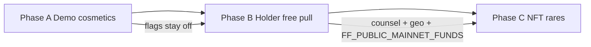
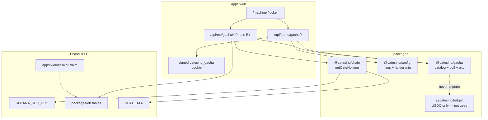

# Catesino Gacha — Cosmetics to $CATE NFTs

| Field | Value |
|-------|--------|
| **Document** | Product & Technical Design — Cate Machine (gacha) |
| **Author** | Systems Architecture (draft); product DRI TBD |
| **Date** | 2026-08-13 |
| **Status** | Draft |
| **Version** | 0.1.3 |
| **Workspace** | `C:\PersonalProject\Catesino` |
| **Parent design** | [`docs/design/catesino-design-v0.2.2.md`](C:\PersonalProject\Catesino\docs\design\catesino-design-v0.2.2.md) (v0.2.2) |
| **Readiness** | [`docs/readiness-roadmap.md`](C:\PersonalProject\Catesino\docs\readiness-roadmap.md) |
| **Normative monorepo** | `apps/web`, `apps/worker`, `packages/*` |

### Changelog

| Version | Date | Notes |
|---------|------|--------|
| 0.1.0 | 2026-08-13 | Initial draft. Freezes demo loop, Yarn economy, public odds, hard pity, Phase A/B/C gates. |
| 0.1.1 | 2026-08-13 | Review: signed-cookie Phase A store (no Vercel Map); `rollPull` vs host economy; no supply-capped items in A; Phase B catalog slice + SIWS UI blocker; HMAC/verify receipt; paid-pull gates + `capturePurchase`. |
| 0.1.2 | 2026-08-13 | Review: dedicated 180-day gacha seal (not SIWS 24h idle); last-write-wins pulls; one RPC per token program; split NFT vs paid asserts; freeze Upstash G10b keys. |
| 0.1.3 | 2026-08-13 | Product confirmed Q1, Q3, Q4, Q7, Q8, Q9 (match frozen defaults). |

### Reversibility legend

- **R0** — reversible anytime via config/flag
- **R1** — reversible with migration / eng work
- **R2** — hard to reverse (brand, public claims, custody, legal posture)

This document is a **sibling** of v0.2.2, not a rewrite. House games remain money-in / money-out. The Cate Machine is money-in / **culture-out**. Where this spec is silent, v0.2.2 wins (USDC-only play credits, `ff_public_mainnet_funds`, age/geo, commit–reveal honesty, no god-hot-wallet).

---

## Overview

Catesino already has a working **demo casino**: eight Cate-branded house games, a shared in-memory USDC credit ledger, server-authoritative engines, and feature flags that keep real funds off (`FF_DEPOSITS_USDC`, `FF_WITHDRAWALS`, `FF_PUBLIC_MAINNET_FUNDS` all default `false` in `packages/config/src/schema.ts`). That surface is explicitly a casino. Expanding it by adding another reel in `GAME_CATALOG` would read as “come spin more.”

This spec adds **The Cate Machine**: a gacha ladder that starts as a **demo, off-chain cosmetic dropper** and later becomes the place `$CATE` holders get real token utility (a free / cheaper daily pull) and, only after the same counsel + geo gate as the casino, limited Cate NFTs. Players spend **Yarn** (a non-monetary pull ticket), not USDC play credits. Odds are a versioned public table. Catesino never operates an NFT buyback. Paid USDC pulls for a chance at a valuable NFT are treated as **gambling**, not as “collectibles with extra steps.”

**Frozen implementable default:** ship one complete pull loop in demo (Phase A) with Yarn + **uncapped** off-chain cosmetics + public odds + hard pity, with locker state in a **signed cookie** that survives Vercel isolates. No numbered prints, no Ultra 1/1, no process `Map`. Do not mint, do not take USDC, do not put the Machine on `GameId`. Phase B (`$CATE` holder free pull) is flagged off and **blocked on a SIWS connect UI + wallet locker**, not only RPC. Phase C (NFT rares / paid pulls) waits on counsel + `FF_PUBLIC_MAINNET_FUNDS`.

---

## Background & Motivation

### Current state (repo, 2026-08-13)

| Layer | What exists | Implication for gacha |
|-------|-------------|------------------------|
| Play catalog | `GAME_CATALOG` in `packages/config/src/games.ts` — 8 `GameId`s, all money games | Machine must **not** become `GameId` #9 |
| Feature flags | `FF_*` in `envSchema` → `FeatureFlags` via `loadConfig()` | New gacha flags follow this exact path |
| Demo money | `apps/web/src/lib/demo-session.ts` — **one global** `DemoTable`, `$100` seed, `userId: "demo"` | Cosmetics cannot share that singleton or visitors overwrite each other’s locker |
| Demo APIs | `/api/demo/state`, `/deal`, `/action`, `/instant`, `/videocate` | Add `/api/demo/gacha/*`; do not extend `/instant` |
| RNG | Blackjack: HMAC + rejection sampling (`packages/blackjack/src/engine.ts` `hmacDrawIndex`). Instant games: `rollInt` modulo in `packages/house-games/src/rng.ts` | Published odds **must** use unbiased mapping, not `rollInt` |
| Fairness reveal | Instant games return `serverSeedCommit` + `serverSeed` on the same response (settle-in-one-request) | Machine pulls are the same shape |
| Ledger | `@catesino/ledger` — `available` / `lockedHand` / `lockedWithdraw`, USDC atomic | Yarn is **not** a ledger mint. Do not add `mint: 'YARN'` to `balances` |
| Chain | `@catesino/chain` — SIWS, deposit claim, RPC fetch (`getTransaction` / `getSignatureStatuses` / `getTokenAccountBalance`). `$CATE` mint string lives in `packages/config/src/schema.ts` (`CATE_MINT`); `createChainContext().cateMint` reads it | Phase B adds `getCateHolding` here. No wallet-adapter UI exists yet (readiness: connect flow missing) — holder pull is blocked on that UI |
| DB | `packages/db` stub — `PLANNED_TABLES` only | Phase A **does not** use a process Map. Locker = signed cookie. New table names join the planned list; no live Postgres required to ship demo |
| Worker | `apps/worker` health stub | No mint/transfer jobs until Phase C |
| Compliance | Age/geo config exists; UI gates still thin (readiness Track A/C) | Machine inherits the same scaffolding; paid/NFT waits on `FF_PUBLIC_MAINNET_FUNDS` |
| Voice | Landing (`apps/web/src/app/page.tsx`) is thesis-first, memey, anti-random-ape | Machine copy: culture-out, not “come gamble on JPEGs” |

### Pain this product addresses

| Pain | Response |
|------|----------|
| Site is “just a casino” | Culture sink: frames, titles, locker. House games stay chips; Machine stays drip |
| `$CATE` has no product utility beyond “we might buy it” | Phase B: holders get the free / cheaper pull. Actual token check, not vibes |
| Hidden gacha rates would nuke the daily-buy honesty story | Versioned public odds + commit–reveal, same class of claim as `/transparency` |
| Paid NFT boxes are gambling in many jurisdictions | Demo cosmetics first. Real-money / NFT only behind the existing counsel gate |
| CateSlots already exists | If the Machine spends USDC and sits in the game grid, it **is** another slot. It must not |

### Why not fold this into CateSlots

`playCateSlots` in `packages/house-games/src/cateslots.ts` locks a USDC bet and returns a `StakeLockSettlement`. That is the casino contract. The Machine must never call `lockBet` / `settleHand`. A player who “wins” a frame must not see their USDC chip stack change.

---

## Goals & Non-Goals

### Goals (Phase A — ship now)

1. One complete **demo pull loop**: spend Yarn → server `rollPull` → off-chain cosmetic in a **signed-cookie locker** that works on Vercel serverless.
2. **Public odds** at `/machine/odds` and `GET /api/demo/gacha/odds` (same table, versioned).
3. **Hard pity only**, published, enforced server-side.
4. Equip path: title + frame render on the Machine, Locker, and (lightly) site chrome.
5. Feature flags in `@catesino/config` with paid/NFT/holder paths **default off**.
6. Copy that frames this as culture, not as CateSlots 2.

### Goals (Phase B — after SIWS **UI** + wallet locker + RPC are real)

7. `$CATE` ATA balance check; **one free daily pull entitlement** per wallet per UTC day if holding ≥ threshold. Entitlement does **not** spend Yarn and does **not** write the demo locker.
8. Holder catalog is **Common + Uncommon only** (no Rare/Ultra, no `supplyCap` items) so a token gate is not a raffle for a unique prize.
9. Optional cheaper paid pull later (only if Phase C paid pulls exist). Holders never lose the free daily.

### Goals (Phase C — counsel-gated)

10. Limited-supply Cate NFTs as Rare / Ultra outcomes (first time `supplyCap` is live).
11. Pre-mint + claim for limited editions; pull-time mint only for Ultra 1/1s.
12. Same age / geo / responsible-play / `FF_PUBLIC_MAINNET_FUNDS` stack as house-game funds.

### Non-Goals

- Marketing this as “come start gambling” or “not gambling because it’s an NFT.”
- Catesino buyback, prize cashier, or any USDC/CATE redemption of items.
- Putting the Machine on `GAME_CATALOG` / `GameId`.
- Spending or earning USDC play credits on pulls (no rakeback-as-gacha).
- Per-spin Yarn from house-game handle (hidden second casino).
- Staking program, vote-escrow, or off-chain “points” snapshot as the Phase B default.
- Compressed NFTs, custom on-chain program, or marketplace in Phase A/B.
- Merch fulfillment logistics (Uncommon `merch_claim` is a **voucher record** only until ops exists).
- Cross-wallet inventory trade / listing.
- Changing house-game math, free_balance, or the daily buy job.
- Process-global `Map` lockers on `apps/web` (Vercel isolates make them lie; see G21).
- Phase A numbered prints, Ultra 1/1s, or any `supplyCap` item.
- Treating a SIWS cookie helper as a product “connect wallet” flow.

---

## Key Decisions

| # | Decision | Rationale | Rev |
|---|----------|-----------|-----|
| G1 | **Surface is “The Cate Machine,” not a `GameId`** | `GAME_CATALOG` is the casino grid. A ninth card would read as another slot. Routes live under `/machine` + `/locker`. | R2 |
| G2 | **Currency is Yarn, not USDC credits** | House games = chips. Machine = culture. Mixing them trains money-out expectations and would reuse `lockBet`. | R2 |
| G3 | **Phase A spends only Yarn; no USDC, no `$CATE` burn** | Demo + cosmetics first (product constraint). Paid USDC pulls are Phase C and counsel-gated. | R2 |
| G4 | **No Yarn from house-game handle** | Per-spin tickets are a second prize table on the same money. Daily Yarn faucet is the honest drip. | R1 |
| G5 | **Demo locker is a signed cookie, not `DemoTable` and not a process `Map`** | `getDemoTable()` is one process-wide `$100` wallet. A Vercel `Map` is many isolates that forget Yarn/pity/inventory between requests. Locker *is* the product. | R1 |
| G6 | **Odds are a versioned 10_000-weight public table** | Same honesty class as the daily buy log. Hidden rates are a brand-kill. Pity threshold is part of the published rule (G25). | R2 |
| G7 | **Hard pity only. No soft pity.** | Soft pity silently changes published rates unless the whole curve is public. Hard pity is one extra published rule. | R1 |
| G8 | **RNG: HMAC-SHA256 + rejection sampling over the weight table** | Matches blackjack’s unbiased story. Do **not** reuse `rollInt` modulo (`packages/house-games/src/rng.ts`) for a public table. | R1 |
| G9 | **Commit–reveal on every pull** (instant-game shape) | Pulls settle in one request; return `serverSeedCommit` + revealed `serverSeed` like `/api/demo/instant`. | R1 |
| G10 | **Duplicates stack; overflow → Yarn dust, never USDC** | No cashier. Stack cap converts to +1 Yarn. Vault is for open-market `$CATE` buys, not duplicate sinks. | R1 |
| G11 | **Cosmetics are soulbound. NFTs are the only potentially tradeable kind.** | Phase A items cannot be listed or withdrawn. Phase C NFT tradeability is secondary-market only. | R2 |
| G12 | **Catesino never buys items or NFTs back** | Product constraint. Secondary value is the owner’s problem. Support copy must say this. | R2 |
| G13 | **Phase B holder check = live ATA sum, wallet-bound, UTC day** | No staking program exists. Snapshot is a cache, not the source of truth. Bound to SIWS `walletPubkey`. | R1 |
| G14 | **New package `@catesino/gacha`** | Same purity rule as `@catesino/house-games` / `@catesino/blackjack`. Not a house game — own package so it cannot grow a `StakeLockSettlement`. | R1 |
| G15 | **Paid pulls + NFT prizes require `FF_PUBLIC_MAINNET_FUNDS` plus dedicated flags** | Paid NFT gacha is gambling. Do not pretend otherwise. Same counsel checklist as casino funds. | R2 |
| G16 | **Phase C: pre-mint + claim for limited rares; pull-time mint only for Ultra 1/1s** | A “you won” row with a failed mint is a support incident. Escrowed inventory is claimable. | R1 |
| G17 | **Metaplex Token Metadata (not compressed) for the first collection** | Marketplace-compatible, small supply (hundreds, not 100k). Bubblegum deferred. | R1 |
| G18 | **House pays NFT rent / mint fees from platform equity, not player USDC stake** | Pull price (if any) is a separate Phase C product price, not “the player funded the mint.” | R1 |
| G19 | **Feature flags follow `packages/config` exactly** | `FF_GACHA_*` in `envSchema`, camelCase on `FeatureFlags`. No ad-hoc `process.env` in engines. | R0 |
| G20 | **Product voice: memey, thesis-first, anti-slot** | Landing already says “stop aping. start playing.” Machine copy: “Yarn in. Culture out.” Never “jackpot.” Never “not gambling.” Ledger comments may say “purchase, not a cash-EV wager”; **UI must not.** | R2 |
| G21 | **Phase A persistence = dedicated 180-day HMAC cookie** (`catesino_gacha`) | Parent hosting is Vercel. **Do not** call `sealSession` / `unsealSession` — those expire at `min(issuedAt+7d, now+24h idle)` (`apps/web/src/lib/auth/session.ts`). Locker uses `sealGachaState` with absolute 180-day inner `exp` and `sessionCookieOptions` flags only. No Ultra / no `supplyCap` until a shared store exists. | R1 |
| G22 | **Limited remaining is global to the store, not per identity. Phase A has none.** | Per-locker `remaining` lets every visitor roll Ultra. Unlocked global remaining double-grants `#1/50`. Cookie store cannot CAS a global counter. First `supplyCap` items ship with Redis/Postgres `grantLimited`. | R1 |
| G23 | **Phase B free pull is a daily entitlement, not Yarn** | Flowchart was entitlement; Machine Yarn is a second wallet of rights. Holder pull does not debit Yarn and does not write the demo cookie locker. | R1 |
| G24 | **Holder ATA sum = one RPC per Token + Token-2022, mint filter, skip frozen; no pagination loop** | Standard `getTokenAccountsByOwner` returns `{ context, value }` with **no cursor**. Looping on `context` never terminates. Frozen accounts do not count. `cateToAtomic` is **not** `usdcToAtomic`. | R1 |
| G25 | **Any published-odds input is versioned, including pity** | `GACHA_PITY_RARE_HARD` is env (incident R0) but it is on the odds page and every receipt. Weight changes bump `oddsTableId`. Pity changes show a live banner and tag the receipt `pityRareHard`. | R2 |

---

## Proposed Design

### Positioning (normative)

| Loop | In | Out | Surface |
|------|----|-----|---------|
| House games | USDC credits | USDC credits | `/play/*`, `GAME_CATALOG` |
| Cate Machine | Yarn (later: optional paid USDC) | Cosmetics / merch vouchers / NFTs | `/machine`, `/locker` |
| Daily buy | House equity | `$CATE` in Community Vault | future `/transparency` |

Thesis line for Machine UX (implementers, not the landing hero):

> House games are chips. This is drip. Yarn in, culture out. We do not cash your frames.

Do **not** use “spin,” “jackpot,” or “slot” as the primary verb. Verb is **pull** (yank the yarn).

### Phasing



| Phase | Spend | Drops | Identity | Gate |
|-------|-------|-------|----------|------|
| **A — Demo loop** | Yarn faucet | Uncapped off-chain cosmetics + `yarn_dust`. **No** `supplyCap`, **no** Ultra, **no** numbered prints. Rare exists as an unlimited cosmetic so pity can fire. | Sealed `catesino_gacha` cookie | `FF_GACHA_ENABLED` (default **true**) |
| **B — Holder utility** | 1 **free entitlement** / UTC day if ATA ≥ threshold (does not spend Yarn) | **Common + Uncommon only** (badge, yarn_dust, titles). Never Rare/Ultra, never `supplyCap`. | SIWS `walletPubkey` + **wallet locker** | `FF_GACHA_CATE_HOLDER_PULL` (default **false**) + RPC + **connect UI** |
| **C — NFT + paid** | Optional USDC paid pull via `capturePurchase`; holder free pull remains | First `supplyCap` items: `kind: nft` Rare/Ultra; merch claims | SIWS + age/geo | `FF_GACHA_PAID_PULLS` ∧ `FF_DEPOSITS_USDC` ∧ `FF_PUBLIC_MAINNET_FUNDS`; NFT kinds also need `FF_GACHA_NFT_PRIZES` |

Phase A must be playable **without a wallet**, matching current `/play` demo.

### Architecture



**Import rule:** `@catesino/gacha` depends on `@catesino/game-protocol` only if it needs shared seed types; it must **not** import `@catesino/ledger` or return `StakeLockSettlement`. That is the architectural guarantee this is not a house game.

### The Cate Machine loop (Phase A)

Engine is **pure RNG**. Host owns Yarn, stacks, and numbering (none in A).

```mermaid
sequenceDiagram
  participant P as Browser
  participant API as POST /api/demo/gacha/pull
  participant S as sealed catesino_gacha cookie
  participant E as rollPull (@catesino/gacha)

  P->>API: { clientSeed? }
  API->>S: unsealGachaState (180d exp, not sealSession)
  alt yarn < 1
    API-->>P: 400 yarn_empty
  else
    API->>S: yarn -= 1; nonce += 1
    API->>E: rollPull(odds, catalog, pityBefore, seeds, nonce)
    Note over E: no inventory, no yarnDelta
    E-->>API: rarity, itemId, rawBucket, pityApplied, pityAfter, fairness
    alt item.kind == yarn_dust
      API->>S: yarn += item.yarnGrant
    else count of itemId already == stackCap
      API->>S: yarn += 1
      Note over API: convertedToYarn
    else
      API->>S: inventory count += 1
    end
    API->>S: persist pityAfter; sealGachaState
    Note over API: last-write-wins if two POSTs race
    API-->>P: full receipt including serverSeed
  end
```

### Package: `@catesino/gacha`

New workspace package, clone the shape of `packages/house-games` (`type: module`, `vitest`, `tsc`, export `.`).

```text
packages/gacha/
  src/
    index.ts
    types.ts
    catalog.ts          # versioned items + weights
    odds.ts             # ODDS_TABLE_V1, formatPublicOdds
    pity.ts             # hard pity mutation
    pull.ts             # rollPull — pure RNG + pity, no economy
    apply.ts            # applyEconomy — host-side yarn/stack (tested; used by web)
    rng.ts              # HMAC + rejection sampling (Buffer key + counter)
    verify.ts           # client-verifiable replay; derives pityApplied
    pull.test.ts
  package.json          # @catesino/gacha
  vitest.config.ts
```

Add `pnpm test:gacha` in the root `package.json` next to `test:blackjack` / `test:ledger`.

### Rarity ladder (product-agreed)

| Rarity | Phase A drop | Phase B holder catalog | Phase C add |
|--------|--------------|------------------------|-------------|
| **Common** | PFP frames, titles, lobby flair, meme unlocks | Same kinds (wallet locker) | — |
| **Uncommon** | Extra Yarn (2), holder-style badge (cosmetic), merch voucher **stub** | Badge + yarn_dust + titles/frames only — **no** merch voucher | Real `merch_claim` when ops exists |
| **Rare** | **Uncapped** off-chain cosmetic (`frame.ninth-life`). Not numbered. `supplyCap: null` | **Not rolled.** Holder eligibility never selects Rare | Limited Cate NFT (`supplyCap` live) |
| **Ultra** | **Not in catalog.** Weight 50 falls back to Rare (published) | **Not rolled.** | 1/1 NFT |

Phase A Rare is **not** an NFT and **not** scarce. It exists so the 3.50% bucket and hard pity can be felt. UI must say “off-chain. not an NFT. we don’t cash this.”

**Phase B must not roll `supplyCap` items** (there are none in A either) **and must not roll Rare/Ultra**, even off-chain. Holding `$CATE` as the ticket to a random unique/numbered prize is the raffle the compliance table is trying to avoid. Holder pull uses `oddsTableId = catesino-machine-odds-holder-v1` (Common 8000 / Uncommon 2000). No pity on that table.

### Public odds (frozen table v1)

Weights are integers that sum to **10_000** (basis points). This is the published table.

| Rarity | Weight | Percent | Phase A meaning |
|--------|--------|---------|-----------------|
| Common | 8000 | 80.00% | Cosmetic |
| Uncommon | 1600 | 16.00% | Cosmetic / Yarn dust / badge |
| Rare | 350 | 3.50% | Uncapped off-chain cosmetic |
| Ultra | 50 | 0.50% | **No items** — published fallback to Rare |

**Expected pulls to Rare+ (no pity):** \(10000 / 400 = 25\). In Phase A every Ultra bucket hit becomes Rare (effective Rare+ = 4.00% still).

Within a rarity, items share the bucket **uniformly** among authored items with `remaining > 0` (Phase A: all `supplyCap` are `null`, so all authored items of that rarity). If a rarity has zero in-supply items, its weight rolls down (Ultra → Rare → Uncommon → Common). Phase A Ultra→Rare is the only live fallback; it is printed on `/machine/odds`.

Catalog + odds are versioned together:

```text
oddsTableId = "catesino-machine-odds-v1"           # Phase A demo
oddsTableId = "catesino-machine-odds-holder-v1"    # Phase B: 8000 / 2000, no pity
catalogId   = "catesino-machine-catalog-v1"        # Phase A items
catalogId   = "catesino-machine-catalog-holder-v1" # Common+Uncommon subset
```

Any **weight** change bumps `oddsTableId`. A **pity** change does not silently keep `v1`: receipts carry `pityRareHard`; the odds page prints the live `config.gacha.pityRareHard` and a banner if it differs from the table footnote (80). Old receipts still verify against the `oddsTableId` + `pityRareHard` + `inSupplyHash` on that receipt.

### Pity (frozen)

**Hard pity only. No soft pity. No hidden rate ramp.**

| Counter | Rule |
|---------|------|
| `pullsSinceRarePlus` | Increment on every non-Rare/Ultra. Reset to 0 on Rare or Ultra. |
| Threshold | **80** (`PITY_RARE_HARD = 80`, also `GACHA_PITY_RARE_HARD` env) |
| Fire | When `pullsSinceRarePlusBefore >= 80` at the **start** of a pull, force rarity = Rare (or keep Ultra if the unbiased roll already hit Ultra — N/A in Phase A). That pull is **not** empty. |
| Test wording | After **80** non-Rare+ pulls, pull **81** is forced Rare. Not “81st empty.” |
| Ultra | **No pity.** (No Ultra items in A; when C ships, 1/1s stay scarce.) |
| Uncommon | **No pity.** 16% is frequent. |
| Phase B holder table | **No pity** (no Rare+ in that table). |

Justification: at 4% Rare+, P(no Rare+ in 80 pulls) ≈ \(0.96^{80} ≈ 3.8\%\). Pity is a published safety rail, not the real drop rate. Soft pity would require publishing a per-pull curve; anything less is a hidden rate change and contradicts G6.

Pity state is **per identity** (demo cookie **or** wallet locker — never mixed), not global, not per-item.

`verifyPull` **derives** `pityApplied` as `pullsSinceRarePlusBefore >= pityRareHard` and the raw rarity was below Rare. It must not trust a client-supplied `pityApplied` flag.

### RNG & fairness

Do **not** call `rollInt` from `@catesino/house-games`. That helper is `SHA256(serverSeed:clientSeed:nonce) % (max+1)` — biased, and already a weaker story than blackjack.

Machine RNG (normative — matches `hmacDrawIndex` in `packages/blackjack/src/engine.ts`: HMAC **key** is the 32-byte seed, rejection counter is in the message):

```text
serverSeedHex = 32 bytes CSPRNG, hex-encoded (64 chars)
key           = Buffer.from(serverSeedHex, "hex")   // NOT the hex string as key
clientSeed    = client-supplied (≤ 64 chars) or server default "yarn"
nonce         = per-identity monotonic int, +1 per pull (including pity-forced)
pityRareHard  = value used for this pull (from config; written on the receipt)

function hmacIndex(key, clientSeed, nonce, lane, size):
  # lane is "rarity" or "item"
  max = 2^32
  limit = max - (max % size)
  counter = 0
  loop:
    msg = `${clientSeed}:${nonce}:${lane}:${counter}`
    digest = HMAC_SHA256(key, msg)          // Node: createHmac("sha256", key).update(msg)
    n = digest.readUInt32BE(0)
    if n < limit: return n % size
    counter += 1
    if counter > 1000: throw

rawBucket = hmacIndex(key, clientSeed, nonce, "rarity", 10000)   # 0..9999
rawRarity = first bucket whose cumulative weight contains rawBucket
            (after published fallbacks, e.g. Ultra→Rare when no Ultra items)

pityApplied = (pullsSinceRarePlusBefore >= pityRareHard)
              AND rawRarity is not Rare and not Ultra
rarity      = Rare if pityApplied else rawRarity

inSupply    = authored item ids of `rarity` with remaining > 0
              (Phase A: all authored items of that rarity; remaining is unused)
inSupplyHash = sha256(inSupply.join(","))   # ids sorted ASCII, comma-joined
itemIndex   = hmacIndex(key, clientSeed, nonce, "item", inSupply.length)
itemId      = inSupply[itemIndex]
```

Pity is applied **after** the rarity roll and **before** the item roll (item lane uses the **final** rarity’s in-supply list).

Golden vectors live in `packages/gacha/src/pull.test.ts` and must use the Buffer key, not a hex-string key.

**What the receipt proves:** given `serverSeed`, `clientSeed`, `nonce`, `oddsTableId`, `catalogId`, `pityRareHard`, `pullsSinceRarePlusBefore`, and `inSupplyHash` (or the id list), anyone can recompute `rawBucket`, derived `pityApplied`, rarity, and item. `/machine/odds` ships a “verify this pull” form (Phase A: `<details>`). `verifyPull` recomputes pity; it does **not** take `pityApplied` as trusted input.

**What we do not claim:** Yarn faucet grants are commit–revealed (they are a rate-limited drip, not a prize). Phase A does not prove global scarcity (there is none).

No `Math.random`. No pre-settle seed logs. Never log `serverSeed` at `info`.

### Currencies / pull economy

#### Yarn (canonical pull ticket)

| Property | Freeze |
|----------|--------|
| Name | **Yarn** (cat / yarn-ball pun; not “ticket,” “key,” or “gem”) |
| Unit | Integer. 1 Yarn = 1 pull |
| Not a mint | Never appears in `@catesino/ledger` or `balances.mint` |
| Not withdrawable | No cashier, no USDC conversion |
| Phase A grant | **Day 0** = `GACHA_YARN_START` only (**5**). First `GET /api/demo/gacha/state` sets `lastFaucetUtcDate` to **today UTC** so the daily `+1` starts **tomorrow**. Not 5+1 on first visit. |
| Faucet cap | Daily `+1` **skips** when `yarn >= GACHA_YARN_CAP` (20). Cap is **faucet-only**. |
| Dust vs cap | `yarn_dust` (+2) and stack-overflow (+1) **may exceed 20**. Host applies them after the 1-Yarn spend. |
| Duplicate overflow | If a soulbound cosmetic is already at `stackCap` (default **5**), host still spent 1 Yarn, does not increment count, grants **+1 Yarn** back, sets `convertedToYarn: true` on the receipt |
| House-game earn | **None** (G4) |
| USDC buy Yarn | **None** in A/B. Phase C only, behind paid-pull flags |

Demo USDC credits (`creditDeposit(..., usdcToAtomic(100), "demo-seed")` in `demo-session.ts`) are **untouched**. A pull must not read or write `table.ledger`.

#### Later live spend (Phase C only)

| Spend | Who | Gate |
|-------|-----|------|
| Free daily pull | Wallet with `$CATE` ≥ `CATE_HOLDER_MIN` | `FF_GACHA_CATE_HOLDER_PULL` |
| Paid USDC pull | Anyone who passed age/geo and is not self-excluded | `FF_GACHA_PAID_PULLS` ∧ `FF_PUBLIC_MAINNET_FUNDS` ∧ `FF_DEPOSITS_USDC` |
| Holder discount | Same wallet, paid pull | **50% of `GACHA_PAID_PULL_USDC`** (default paid price **$2 USDC**, holder **$1**) |

Paid pull **debits USDC available** via a **new** ledger primitive — do **not** reuse `lockBet` / `settleHand` / fake `player_lose`. Current `@catesino/ledger` conserves `credit + houseDelta === bet` over `StakeLockSettlement` (`assertValidSettlement`). A purchase is not a hand:

```ts
// packages/ledger — Phase C only; not in G1–G13 implementation
export function capturePurchase(
  ledger: LedgerSnapshot,
  userId: string,
  amountAtomic: bigint,
  idempotencyKey: string,
): UserBalance;
// available -= amount; housePlayEquity += amount.
// Throws if insufficient available. No lockedHand. Not a StakeLockSettlement.
```

Accounting comment (code/docs only, **never UI**): this is a purchase of a random prize, not a cash-EV wager. Product/legal still treat paid pulls as **gambling** (G15). UI must not say “not a wager,” “loot box,” or “not gambling.”

Default paid price is R0 config (`GACHA_PAID_PULL_USDC=2`). Do not implement `capturePurchase` until Phase C.

#### `$CATE` holder check (Phase B)

```mermaid
flowchart TD
  A[SIWS session walletPubkey] --> B{FF_GACHA_CATE_HOLDER_PULL?}
  B -->|no| Z[403 flag off]
  B -->|yes| C[Cache key holder:cate:wallet TTL 60s]
  C -->|hit| D[use cached atomic]
  C -->|miss| E[one getTokenAccountsByOwner per program]
  E --> F[sum value[] unfrozen amount]
  F --> D
  D --> G{atomic >= CATE_HOLDER_MIN_ATOMIC?}
  G -->|no| H[eligible: false]
  G -->|yes| I{already pulled free today UTC?}
  I -->|yes| J[nextFreeAt = next 00:00 UTC]
  I -->|no| K[grant 1 free pull entitlement]
```

| Property | Freeze |
|----------|--------|
| Source of truth | On-chain token accounts for `CATE_MINT` (default in `packages/config/src/schema.ts`, exposed as `createChainContext().cateMint`) owned by the SIWS wallet |
| Programs | Query **both** Token (`TokenkegQfeZyiNwAJbNbGKPFXCWuBvf9Ss623VQ5DA`) and Token-2022 (`TokenzQdBNbLqP5VEhdkAS6EPFLC1PHnBqCXEpPxuEb`). Mint filter on each. Pump.fun lineage is *likely* legacy SPL — not verified here (Q2/Q11). |
| RPC shape | **One** `getTokenAccountsByOwner` per program. Params: owner, `{ mint }`, `{ encoding: "jsonParsed", commitment: "confirmed" }`. Response is `{ context: { slot }, value: Account[] }` — **`context` is never empty and there is no cursor.** Do not loop on `page` / `result.context`. Sum `value[]`. Fail closed if RPC errors or `value` is missing. Mint-filtered wallets are 0–2 accounts. If a provider truncates `value` (no official signal), treat as `rpc_unavailable` — do not invent pagination. |
| Amount | Sum jsonParsed `tokenAmount.amount` (string integer). **Skip** accounts with `state === "frozen"`. Do **not** add delegated amount as extra (owner remaining amount is what `amount` already is). |
| Not staked | No stake program. Wrapped/staked derivatives do not count until product reopens this |
| Not a daily snapshot job | Snapshot is only a **60s cache** to protect RPC. A sell that lands before cache expiry can still pull once — accepted residual, documented |
| Decimals | `CATE_DECIMALS` new config field, default **6**. Convert with **`cateToAtomic(human, CATE_DECIMALS)`** — do **not** call `usdcToAtomic`. Confirm on-chain via `getTokenSupply` before Phase B ships (Q2) |
| Threshold | `CATE_HOLDER_MIN` default **100_000** human `$CATE`. R0 |
| Day | **UTC** date `YYYY-MM-DD`. One free **entitlement** per wallet per day (`gacha_holder_grants` PK) |
| Binding | Wallet pubkey, not demo cookie, not IP. Same wallet on two browsers shares the daily |
| Yarn | Entitlement **does not spend Yarn** and does not read/write `catesino_gacha` |
| Sybil | Accepted residual in B (one wallet = one free pull). No proof-of-personhood |
| RPC | Reuse `SOLANA_RPC_URL` + existing `RpcFetch`. New `getCateHolding` in `packages/chain` |

If RPC fails: **do not grant** the free pull. Return `holderCheck: "rpc_unavailable"`. Fail closed.

### Drop catalog

#### Item schema (normative)

```ts
export type GachaRarity = "common" | "uncommon" | "rare" | "ultra";
export type GachaKind = "cosmetic" | "yarn_dust" | "merch_claim" | "nft";
export type CosmeticSlot = "frame" | "title" | "lobby_flair" | "meme_unlock";

/** Authored catalog + runtime remaining. Engine sees this; host persists remaining only when supplyCap != null (not Phase A). */
export type CatalogState = {
  catalogId: string;
  oddsTableId: string;
  items: GachaItem[];
  /** itemId → remaining. Omitted/ignored when item.supplyCap === null. */
  remaining: Record<string, number>;
};

export type GachaItem = {
  id: string;                 // stable, e.g. "frame.gold-paw.01"
  name: string;
  rarity: GachaRarity;
  kind: GachaKind;
  slot?: CosmeticSlot;        // required if kind=cosmetic
  soulbound: boolean;         // true for all Phase A items
  tradeable: boolean;         // false until kind=nft && Phase C collection says so
  stackCap: number;           // default 5
  yarnGrant?: number;         // kind=yarn_dust only (Phase A: 2)
  supplyCap: number | null;   // Phase A: always null. Phase C: Ultra 1; Rare e.g. 50
  render: {
    emoji: string;
    cssClass?: string;        // e.g. "frame-gold-paw"
    imageSrc?: string;        // /memes/... or /machine/...
  };
  copy: string;               // locker blurb
  /** Phase C only */
  nft?: {
    collectionId: string;
    mint?: string;            // filled after mint/claim
    metaplexStandard: "token-metadata";
  };
};

export type PullReceipt = {
  pullId: string;
  oddsTableId: string;
  catalogId: string;
  rarity: GachaRarity;
  itemId: string;
  pityRareHard: number;
  pullsSinceRarePlusBefore: number;
  pityApplied: boolean;       // derived; verify recomputes this
  rawBucket: number;          // 0..9999 after rejection sampling
  inSupplyHash: string;       // sha256 of sorted in-supply ids at grant
  convertedToYarn: boolean;   // host economy, not engine
  yarnAfter: number;          // host
  serverSeedCommit: string;
  serverSeed: string;         // revealed (instant settle)
  clientSeed: string;
  nonce: number;
  identityKind: "demo" | "wallet";
};
```

Phase A catalog (implement this list; art can be emoji-first). **Every row `supplyCap: null`.**

| id | rarity | slot | notes |
|----|--------|------|-------|
| `frame.cardboard.01` | common | frame | Default-looking paw frame |
| `frame.yarn.01` | common | frame | Yarn-ball frame |
| `title.alley-cat` | common | title | “alley cat” |
| `title.fed-the-cat` | common | title | “fed the cat” |
| `flair.paw-print` | common | lobby_flair | Tiny paw on `/play` teaser hover |
| `meme.unlock.believe` | common | meme_unlock | Unlocks a sticker on `/locker` |
| `yarn.ball.x2` | uncommon | — | `kind: yarn_dust`, `yarnGrant: 2` (host: spend 1, grant 2 → net +1) |
| `title.holder-in-spirit` | uncommon | title | Cosmetic stand-in for the later holder badge |
| `frame.gold-paw.01` | uncommon | frame | Gold ring |
| `merch.sticker-voucher` | uncommon | — | `kind: merch_claim`, **unfulfilled stub**, copy says “not shipping, this is a pretend voucher” |
| `frame.ninth-life` | rare | frame | Uncapped rare cosmetic. **Not** numbered. **Not** `print.ninth-life.#k` |

No Ultra row in v1. Ultra weight falls back to Rare (published).

Phase B holder catalog = Common + Uncommon **badges / titles / frames / yarn_dust only**. Drop `frame.ninth-life` (Rare) and `merch.sticker-voucher` (even a pretend voucher is a prize).

#### Inventory (who owns what)

**Phase A store — signed cookie, not a process `Map`.**

`apps/web` already targets Vercel (`apps/web/vercel.json`). A process-global `Map<demoId, DemoGachaState>` dies when the isolate dies; consecutive requests for the same browser fork Yarn, pity, and inventory. That is worse than today’s USDC demo lie (`getDemoTable()` one shared `$100`): chips are fungible; the locker **is** the product.

```ts
/** Cookie lastReceipt — verify fields only. Omit serverSeed (already on the pull HTTP body). */
export type CookieReceipt = Omit<PullReceipt, "serverSeed">;

export type DemoGachaState = {
  v: 1;
  demoId: string;             // 16-byte hex, generated once
  yarn: number;
  lastFaucetUtcDate: string;  // YYYY-MM-DD; set to today on first seal
  nonce: number;
  pullsSinceRarePlus: number;
  inventory: { itemId: string; count: number }[];  // no acquiredAt[] — cookie budget
  equipped: { frame?: string; title?: string; lobbyFlair?: string };
  lastReceipt: CookieReceipt | null;
};
```

Cookie **`catesino_gacha`**: dedicated seal in `apps/web/src/lib/demo-gacha-session.ts`. **Do not import `sealSession` / `unsealSession` or the SIWS `ABSOLUTE_TTL_MS` (7d) / `IDLE_TTL_MS` (24h).** Those helpers will treat a yesterday’s locker as tamper → empty locker (new `demoId`, 5 Yarn) while `Set-Cookie` max-age still says 180 days.

```ts
const GACHA_TTL_MS = 180 * 24 * 60 * 60 * 1000;

export function sealGachaState(
  state: DemoGachaState,
  secret: string,
  nowMs = Date.now(),
): string {
  const exp = nowMs + GACHA_TTL_MS; // absolute 180d — no idle window
  const body = JSON.stringify({ p: state, exp });
  const mac = createHmac("sha256", secret).update(body).digest("base64url");
  return Buffer.from(JSON.stringify({ p: state, exp, mac }), "utf8").toString("base64url");
}

export function unsealGachaState(
  token: string,
  secret: string,
  nowMs = Date.now(),
): DemoGachaState | null {
  // verify mac with timingSafeEqual; reject if nowMs > exp
  // no lastSeenAt, no 7d/24h constants
}
```

Reuse from `session.ts` **only**: HMAC-SHA256 + `timingSafeEqual` + `sessionCookieOptions(180 * 24 * 3600)` (`httpOnly`, `sameSite: "lax"`, `secure` when `NODE_ENV === "production"`, `path: "/"`). Secret: `GACHA_COOKIE_SECRET` or fallback `SESSION_SECRET`. **Not** the SIWS `catesino_session`. Set/rotated on first `GET /api/demo/gacha/state`.

**Sealed size (normative):** G3 fixture measures the **base64url token** (not pre-seal JSON) for worst-case inventory (all Phase A item ids) + max 64-char `clientSeed` + full `CookieReceipt`. Must be **&lt; 3500 bytes** so the header stays under the ~4 KB cookie cap after `~4/3` encoding of `{p, exp, mac}`. Dropping `serverSeed` from the cookie is required for this budget. Full receipt including seed is only in the pull JSON.

This is deliberately **separate** from `getDemoTable()` so two visitors never share lockers, and USDC demo isolation (still a Track A gap) is not blocked on gacha.

**Do not put `supplyCap` remaining in this cookie.** Remaining is global (G22). Phase A has none.

**Phase B store (required before user-visible holder pull):** Upstash Redis (parent stack, readiness Track B2). **Forbidden:** Vercel `Map`, Fly in-process memory (Machine is served from Vercel). Neon/Drizzle is a later migration of the same key layout, not a G10b option fork.

```text
# locker JSON (WalletGachaState: nonce, pity, inventory, equipped, lastReceipt)
gacha:wallet:{walletPubkey}          GET/SET   no TTL (or 400d)

# daily free entitlement — atomic
gacha:grant:{walletPubkey}:{YYYY-MM-DD}   SETNX pullId   TTL 48h

# ATA cache
gacha:holder:{walletPubkey}          SET atomic   TTL 60s
```

`SETNX` of the grant key **is** the `(wallet, utc_date)` unique. If `SETNX` fails, return `freeUsedToday: true` — do not pull. If `UPSTASH_REDIS_URL` is unset, eligibility/pull APIs return **503** and `FF_GACHA_CATE_HOLDER_PULL` stays off. G11 does not ship without this.

**Phase B+ tables** (extend `packages/db` `PLANNED_TABLES`, Drizzle when that PR lands):

```text
gacha_identities     -- demo_id OR user_id, yarn, nonce, pity, last_faucet_utc
gacha_inventory      -- identity_id, item_id, count, first_acquired_at
gacha_equips         -- identity_id, slot, item_id
gacha_pulls          -- id, identity_id, receipt jsonb, created_at
                     -- UNIQUE (identity_id, nonce)
gacha_holder_grants  -- wallet_pubkey, utc_date, pull_id
                     -- PRIMARY KEY (wallet_pubkey, utc_date)
gacha_nft_claims     -- pull_id, item_id, mint, status queued|minted|transferred|failed
```

`gacha_pulls` receipts are the fairness audit log (public seed after settle, same discipline as `blackjack_hands.server_seed`).

#### How it renders

| Slot | Where |
|------|--------|
| `title` | Site header wordmark subtitle when equipped; Locker hero |
| `frame` | Avatar/coin around `/memes/cate-launch.jpg` on `/machine` and `/locker` |
| `lobby_flair` | Small mark on the Machine teaser on `/play` (not on house-game cards) |
| `meme_unlock` | Gallery section on `/locker` |

No global profile page exists today. **Do not invent `/profile`.** Locker is the collection page.

### NFT phase (C only — design freeze, do not build in PR 1)

| Topic | Freeze |
|-------|--------|
| Collection | One Metaplex collection NFT, working name **“Catesino Ninth Life”**, symbol `9LIFE`. Artist / metadata URI is an Open Question |
| Rare | Limited editions (e.g. 50). **Pre-mint** into a house escrow ATA / NFT custody wallet. Pull inserts a `gacha_nft_claims` row; worker transfers to the player’s wallet |
| Ultra | 1/1s. **Pull-time mint** with unique metadata. Worker job; pull receipt status `nft: pending` until confirmed. UI never says “you have the mint” until `transferred` |
| Standard | Metaplex Token Metadata v1.1 (not compressed). Supply is tens–hundreds |
| Rent / fees | Paid by platform (buy-hot SOL or a dedicated mint-hot with a hard SOL cap). Not taken from the player’s USDC stake beyond the published pull price |
| Failed transfer | Item stays `kind: nft` in locker as **unclaimed**; retry job; support can re-queue. Never delete the pull |
| Buyback | **Forbidden.** No `/api/me/gacha/sell`. No treasury bid. Secondary only (Magic Eden / Tensor — not operated by us) |
| Soulbound NFTs | Default **tradeable** for Rare/Ultra NFTs (otherwise “NFT” is just a worse cosmetic). Product may mark a specific Ultra soulbound; that is per-item, not a collection default |

### Product surface

#### Routes

| Route | Role |
|-------|------|
| `/machine` | The Cate Machine — Yarn balance, pull CTA, last receipt, pity meter |
| `/machine/odds` | Public table, pity rule, version, verify form |
| `/locker` | Inventory, equip, (later) NFT claim status |

**Not** `/play/gacha`. **Not** `/play/cateslots` adjacent as a catalog entry.

#### Lobby treatment

`apps/web/src/app/play/page.tsx` currently maps `listPlayableGames()` into `.game-grid`. Add a **sibling** teaser **above** the grid, not inside `GAME_CATALOG`:

```tsx
<section className="machine-teaser">
  {/* kicker: yarn in · culture out */}
  {/* CTA → /machine */}
  {/* secondary → /locker, /machine/odds */}
</section>
```

`listPlayableGames` in `apps/web/src/lib/games.ts` stays house-games-only.

#### Nav

`SiteHeader` links are Home / Games / How to / The deal. Add **Machine** → `/machine`. Locker is reachable from Machine + teaser, not required on the primary nav (keeps chrome small).

#### Framing so it does not read as another slot

| Do | Don’t |
|----|-------|
| Big yarn ball / cat toy visual | Reel strips, 7-7-7, spin button |
| Pity as “pulls since a rare frame” meter | “BONUS ROUND” |
| Odds link in the same viewport as the pull button | Odds buried in a footer |
| “This is not CateSlots. CateSlots pays chips.” | “Win big” |
| Equip preview (frame around the cat) | Confetti jackpot full-screen every Common |

Phase A pull animation: the cat bats a yarn ball once. One beat. Receipt card. No multi-reel stop.

### Feature flags & config (extend `packages/config/src/schema.ts`)

New env keys (all go through `boolFromEnv` / `numberFromEnv` like the rest):

| Env | Default | Maps to |
|-----|---------|---------|
| `FF_GACHA_ENABLED` | `true` | `flags.gachaEnabled` — Machine routes + demo APIs |
| `FF_GACHA_CATE_HOLDER_PULL` | `false` | `flags.gachaCateHolderPull` |
| `FF_GACHA_PAID_PULLS` | `false` | `flags.gachaPaidPulls` |
| `FF_GACHA_NFT_PRIZES` | `false` | `flags.gachaNftPrizes` |
| `CATE_DECIMALS` | `6` | `mints.cateDecimals` |
| `CATE_HOLDER_MIN` | `100000` | `gacha.holderMinHuman` + atomic |
| `GACHA_PAID_PULL_USDC` | `2` | `gacha.paidPullUsdc` |
| `GACHA_PITY_RARE_HARD` | `80` | `gacha.pityRareHard` |
| `GACHA_YARN_FAUCET_DAILY` | `1` | `gacha.yarnFaucetDaily` |
| `GACHA_YARN_START` | `5` | `gacha.yarnStart` |
| `GACHA_YARN_CAP` | `20` | `gacha.yarnCap` |

`FeatureFlags` in `schema.ts` gains the four booleans. `AppConfig` gains a `gacha` object (same style as `betLimits` / `buyPolicy`).

Hard gate helpers (next to `assertRealFundsMovementAllowed`). **`gachaNftPrizes` is not required to take money** — it only changes prize kinds. **Paid/deposits flags are not required to award an NFT** on a free holder pull. Paying USDC for a random prize is the regulated act even if prizes stay off-chain. NFT on mainnet still needs `FF_PUBLIC_MAINNET_FUNDS`.

```ts
export function assertGachaPaidAllowed(config: AppConfig): void {
  if (!config.flags.gachaEnabled) throw new Error("Gacha disabled (FF_GACHA_ENABLED)");
  if (!config.flags.gachaPaidPulls) throw new Error("Paid pulls disabled (FF_GACHA_PAID_PULLS)");
  if (!config.flags.depositsUsdc) throw new Error("USDC deposits disabled (FF_DEPOSITS_USDC)");
  if (config.cluster === "mainnet-beta" && !config.flags.publicMainnetFunds) {
    throw new Error("Public mainnet funds disabled (FF_PUBLIC_MAINNET_FUNDS) — counsel gate");
  }
}

export function assertGachaNftAllowed(config: AppConfig): void {
  if (!config.flags.gachaEnabled) throw new Error("Gacha disabled (FF_GACHA_ENABLED)");
  if (!config.flags.gachaNftPrizes) throw new Error("NFT prizes disabled (FF_GACHA_NFT_PRIZES)");
  if (config.cluster === "mainnet-beta" && !config.flags.publicMainnetFunds) {
    throw new Error("Public mainnet funds disabled (FF_PUBLIC_MAINNET_FUNDS) — counsel gate");
  }
  // Does NOT require gachaPaidPulls or depositsUsdc.
  // Holder free entitlement may award kind:nft once counsel turns this on.
}

// Paid NFT pull: call both helpers.
// Free holder NFT: assertGachaNftAllowed + FF_GACHA_CATE_HOLDER_PULL only.

export function cateToAtomic(human: number, decimals: number): bigint {
  // same integer-safe rounding as usdcToAtomic, but decimals is an argument
  // MUST NOT call usdcToAtomic / USDC_DECIMALS
}
```

`packages/config/src/schema.test.ts` must cover: defaults off for B/C flags, on for `gachaEnabled`, `cateToAtomic` does not use `USDC_DECIMALS`, paid-pull gate throws without `depositsUsdc` **and** without `publicMainnetFunds` on `mainnet-beta`, NFT gate throws without `gachaNftPrizes` **and does not throw** when `depositsUsdc` / `gachaPaidPulls` are false.

### Demo API (Phase A)

Conventions (verified against the repo):

- `runtime = "nodejs"` like existing `/api/demo/*`.
- Prefer `jsonOk` / `jsonError` from `apps/web/src/lib/http.ts` (**`/api/me/*` and `/api/auth/*` style**). Current demo routes use `NextResponse.json` directly — new gacha routes should not copy that.
- `loadConfig()`. `FF_GACHA_ENABLED` off → **403** (rollout kill switch), not 400.
- Structured log on every pull (see Observability); hash `demoId`; never `info`-log `serverSeed`.

| Method | Path | Body | Notes |
|--------|------|------|-------|
| GET | `/api/demo/gacha/state` | — | Seals `catesino_gacha` if missing. Applies UTC faucet (day-0 start only). Returns yarn, pity, equipped, inventory summary, `mode: "demo"` |
| GET | `/api/demo/gacha/odds` | — | Public table + **live** pity threshold + version. No cookie required |
| GET | `/api/demo/gacha/inventory` | — | Full locker |
| POST | `/api/demo/gacha/pull` | `{ clientSeed?: string }` | Spend 1 Yarn. **400** if empty; **403** if flag off. Concurrent double-submit: **last-write-wins** (no 409). Client **disables** the pull button until the response. |
| POST | `/api/demo/gacha/equip` | `{ slot, itemId \| null }` | Must own item |

`GET /api/demo/state` (USDC) is **unchanged**. Optional later: include `{ gacha: { yarn } }` as a non-breaking add — not required for PR 1.

Rate limit: in-memory **IP hash + cookie** **20 pulls / 60s**. A new cookie is a new identity (5 Yarn) — that is accepted on a public demo because Phase A has **no Ultra / no global remaining to empty**. The limiter is anti-spam, not a scarcity guard. In-memory limits are best-effort on Vercel (same isolate gap); good enough when prizes are uncapped cosmetics.

**Concurrent pulls (Phase A freeze):** two parallel `POST`s unseal the same cookie, both spend 1 Yarn, both `Set-Cookie`. **Last `Set-Cookie` wins.** The discarded receipt is gone; nonce/pity follow the winner. Rate limit does not serialize a double-click. Accepted: prizes are uncapped cosmetics, not numbered prints. Do **not** implement 409/`expectedNonce` in Phase A. UI must disable “Yank the yarn” until the in-flight response returns. Phase B `SETNX` grant key is the opposite (first writer wins) because that path is an entitlement.

### Phase B API (do not ship user-visible until G10a connect UI + G10b wallet store)

| Method | Path | Notes |
|--------|------|-------|
| GET | `/api/me/gacha/eligibility` | `requireSession` + ATA check + `freeUsedToday` |
| POST | `/api/me/gacha/pull` | `{ spend: "free" \| "paid", clientSeed? }`. **`assertSameOrigin(req)`** (same helper as `/api/me/deposits/claim` and `/api/me/withdrawals`). `spend: "paid"` also `assertGachaPaidAllowed` |
| GET | `/api/me/gacha/inventory` | **Wallet** locker (`WalletGachaState`), not the demo cookie |

**Demo cookie and SIWS wallet never merge automatically.** A title pulled in demo stays in demo. Copy says so. Avoids “I connected and lost my frame” and avoids “I farmed demo then bound a 1/1 to a wallet.”

---

## API / Interface Changes

### Before

- `GameId` = 8 house games.
- Demo identity = global singleton.
- No inventory, no second currency, no `/machine`.

### After (Phase A)

New package exports (critical interface):

```ts
// packages/gacha/src/pull.ts — RNG only. No yarn, no stackCap.
export function rollPull(input: {
  catalog: CatalogState;
  pullsSinceRarePlusBefore: number;
  pityRareHard: number;
  serverSeed?: string; // hex
  clientSeed?: string;
  nonce: number;
}): {
  rarity: GachaRarity;
  itemId: string;
  rawBucket: number;
  pityApplied: boolean; // derived
  pullsSinceRarePlusAfter: number;
  inSupplyHash: string;
  serverSeed: string;
  serverSeedCommit: string;
  clientSeed: string;
  nonce: number;
  oddsTableId: string;
  catalogId: string;
  pityRareHard: number;
  pullsSinceRarePlusBefore: number;
};

export function verifyPull(
  receipt: Pick<
    PullReceipt,
    | "serverSeed"
    | "clientSeed"
    | "nonce"
    | "oddsTableId"
    | "catalogId"
    | "rarity"
    | "itemId"
    | "rawBucket"
    | "pityRareHard"
    | "pullsSinceRarePlusBefore"
    | "inSupplyHash"
  >,
  catalogAtVersion: CatalogState,
): { ok: true } | { ok: false; reason: string };
// derives pityApplied; compares inSupplyHash; ignores receipt.pityApplied

// packages/gacha/src/apply.ts — host economy, still pure / unit-tested
export function applyEconomy(input: {
  yarn: number;
  inventoryCounts: Record<string, number>;
  item: GachaItem;
}): {
  yarn: number;
  inventoryCounts: Record<string, number>;
  convertedToYarn: boolean;
};
// Caller already subtracted 1 Yarn. yarn_dust adds item.yarnGrant.
// If count >= stackCap, yarn += 1 and count unchanged.
```

`apps/web` depends on `@catesino/gacha` the same way it depends on `@catesino/house-games`.

`SiteHeader` optionally shows equipped title when `/api/demo/gacha/state` says so (client fetch, fail soft).

### After (Phase B)

`packages/chain` gains:

```ts
export async function getCateHolding(input: {
  ownerPubkey: string;
  cateMint: string;
  rpcUrl: string;
  fetchImpl?: RpcFetch;
}): Promise<{ atomic: bigint; accountCount: number; skippedFrozen: number }>;
```

Normative RPC: **one** `getTokenAccountsByOwner` per program (mint filter, `jsonParsed` + `confirmed`). Sum `value[]`, skip frozen. No pagination loop. Reuse `RpcFetch` from `packages/chain/src/rpc-client.ts`. Do not add a new chain SDK.

---

## Data Model Changes

### Phase A (no Postgres, no Redis)

New module `apps/web/src/lib/demo-gacha-session.ts` (do **not** stuff this into `demo-session.ts` or import `sealSession`). `sealGachaState` / `unsealGachaState` as specified under Inventory. Secret: `GACHA_COOKIE_SECRET` or fallback `SESSION_SECRET`. No `Map`. No numbered remaining.

Cookie tamper **or expired 180-day inner `exp`** → treat as empty locker (new `demoId`, 5 Yarn). Do not 500. Do not treat a 25-hour-old cookie as expired.

### Phase B/C (when `packages/db` grows)

Add to `PLANNED_TABLES` in `packages/db/src/index.ts` (PR G12, lands with G2):

`gacha_identities`, `gacha_inventory`, `gacha_equips`, `gacha_pulls`, `gacha_holder_grants`, `gacha_nft_claims`.

Migration strategy: expand-only. Never reuse `balances.mint` for Yarn. `gacha_holder_grants` PK `(wallet_pubkey, utc_date)` is the idempotency key for the daily free entitlement.

`users` (parent design v0.2.2) already has `wallet_pubkey`, `age_acknowledged_at`, `geo_ack_at`, `self_excluded_until`. Phase C paid pulls must check those columns the same way deposits will.

### Supply accounting

**Phase A:** no `supplyCap`. `CatalogState.remaining` is unused. Odds page does **not** apologize for duplicate 1/1s because there are none.

**Phase C (and any future limited demo):** remaining is **global to the store**, not per identity. `grantLimited(itemId)` is compare-and-set:

```text
UPDATE gacha_catalog_remaining
   SET remaining = remaining - 1
 WHERE item_id = $1 AND remaining > 0
RETURNING remaining;
```

Redis equivalent: `DECR` only after `GET` > 0 inside a Lua/Watchexec. Concurrent POSTs serialize here. If CAS fails, `rollPull` is **not** re-run with a new seed; host re-selects uniformly among remaining ids of that rarity (or published fallback) and records `supplyFallback: true` on the receipt. Do not ship `supplyCap` items until this exists.

---

## Alternatives Considered

### 1) Spend USDC demo credits on the Machine

| Pros | Cons |
|------|------|
| One balance pill, less UX | Makes the Machine CateSlots with extra steps |
| Reuses `lockBet` / InstantGameShell | Trains money-out; inventory becomes a “win” |
| Faster to prototype | Violates culture-out positioning; compliance heat even in demo messaging |

**Rejected.** Yarn is the boundary that keeps ledger math and gacha math from coupling.

### 2) Soft pity (rate ramp after N empties)

| Pros | Cons |
|------|------|
| Feels “fair” to gacha-native players | Published odds become a curve, not a table |
| Industry default (Genshin etc.) | Hidden ramp would nuke the transparency thesis |
| | Harder to verify from a receipt |

**Rejected** for Phase A/B. If product later wants a public linear ramp, that is a new `oddsTableId` and an Open Question — not a silent add.

### 3) Put Machine on `GAME_CATALOG` as `catemachine`

| Pros | Cons |
|------|------|
| Free lobby card, flags already map 1:1 | Catalog type is `GameId` of money games |
| `listPlayableGames` “just works” | `/play/rules` money section would have to special-case it |
| | Visual sameness with CateSlots |

**Rejected.** Sibling teaser on `/play` + nav link. Flags still exist; they are just not `FF_*_ENABLED` per `GameId`.

### 4) Pull-time mint for every NFT (no escrow)

| Pros | Cons |
|------|------|
| No inventory of unsold mints | “You won” + failed mint = trust incident |
| | Rent on unused editions is actually *lower* this way, but support cost dominates |

**Rejected** for limited Rares. Kept only for Ultra 1/1s (unique metadata).

### 5) Earn Yarn from house-game play (1 per N hands)

| Pros | Cons |
|------|------|
| Retention hook | Hidden second prize table on USDC handle |
| | Bots grind CateFlip 0% edge for Yarn |
| | Looks like a casino bonus engine |

**Rejected** as default (G4). A later **1 Yarn / UTC day if you settled ≥1 house hand** is an Open Question — still capped, still not per-spin.

### 6) Phase A store: process `Map` vs signed cookie vs Upstash now

| Option | Pros | Cons |
|--------|------|------|
| Process `Map` + demo id cookie | Matches `demo-session.ts` | **Broken on Vercel.** Yarn/pity/locker fork per isolate. Numbered Ultra becomes a lie |
| **HMAC-sealed cookie (chosen)** | Works on every isolate; no new infra; same seal pattern as `catesino_session` | ~4 KB cap; no global remaining; user can reset locker by clearing cookies |
| Upstash Redis now | Shared remaining, durable locker, parent-stack already named | Not wired; readiness Track B2; would block Phase A on infra the repo does not have |

**Chosen: signed cookie (G21).** Consequence: **no `supplyCap` / no Ultra in Phase A** (G22). Revisit Redis when Track B2 or a limited drop needs CAS.

### 7) Put the engine in `@catesino/house-games` vs new `@catesino/gacha`

| Option | Pros | Cons |
|--------|------|------|
| `house-games` module | One less package | Package already returns `StakeLockSettlement`; InstantGameShell / `/instant` would grow a money path by habit |
| **New `@catesino/gacha` (chosen, G14)** | Import ban on ledger is enforceable; purity matches blackjack/house-games (`game-protocol` only) | Extra workspace package |

### 8) Daily `$CATE` snapshot job vs live ATA (G13 / G24)

| Option | Pros | Cons |
|--------|------|------|
| Snapshot job | Stable eligibility; cheaper RPC | Stale balances; new worker; looks like a points program |
| **Live ATA + 60s cache (chosen)** | Source of truth is chain; no stake program | RPC fail-closed; cache can grant once after a sell |

---

## Security & Privacy Considerations

### Threat model (gacha-specific)

| Threat | Severity | Mitigation |
|--------|----------|------------|
| Client spoofs rarity | High | Server-authoritative `rollPull`; client only displays receipt |
| Predict next pull | High | CSPRNG `serverSeed` per pull; HMAC key = 32-byte Buffer; no `Math.random`; seed not reused |
| Bias in modulo mapping | Medium | Rejection sampling with counter (not `rollInt`) + golden vectors |
| Farm locker via many cookies | Medium | New cookie = 5 Yarn + empty locker. **No Ultra to empty.** IP+cookie rate limit is anti-spam |
| Cookie tamper / HMAC fail | Medium | Treat as empty locker; do not 500 |
| Farm free holder pulls via RPC flicker / cache | Medium | Fail closed on RPC error; 1 row per `(wallet, utc_date)`; 60s cache documented |
| CSRF on Phase B pull | High | `assertSameOrigin` on `POST /api/me/gacha/pull` (existing `apps/web/src/lib/auth/origin.ts`) |
| Wallet A pulls, wallet B claims NFT | High | Claim destination **must** equal SIWS `walletPubkey` (same source-binding idea as deposits in v0.2.2 KD 20) |
| Paid pull without counsel gate | Critical | `assertGachaPaidAllowed` checks `gachaPaidPulls` **and** `depositsUsdc` **and** mainnet `publicMainnetFunds` |
| “Cash out my JPEG” social-eng | High | No sell API. Support script: we do not buy back |
| Inventory PII | Low | Demo id is random; no IP stored on locker in Phase A. Phase B stores wallet (already on `users`) |
| Seed leak pre-settle | Medium | Instant settle returns seed only after persist; never log raw seed at info level |
| Admin grants Ultra | Medium | When admin exists: audit log + dual-control for `kind: nft` grants. Phase A: no admin grant API |

### Auth

- Phase A: cookie only. Not a login. Do not call it an account.
- Phase B: existing SIWS cookie (`apps/web/src/lib/auth/session.ts`, `catesino_session`) **plus a connect UI that does not exist yet** (PR G10a: wallet adapter → `/api/auth/nonce` + `/verify` + `assertSameOrigin`). Holder pull requires a valid session; demo cookie is ignored. A “Connect” button with no adapter is a dead control and must not ship.
- Age / geo / self-exclude: **not enforced on Phase A demo Yarn** (matches current house-game demo). **Enforced on Phase C paid pulls** the same way they will be on `/api/me/deposits/claim`.

### Data handling

- Pull receipts are not secret (seeds reveal). Do not put email or IP in receipts.
- NFT metadata URIs: no private photos; treat as public.

---

## Observability

Phase A is demo, but structured logs still start on day one (parent design: money paths log from PR 07; treat pulls as “prize paths”).

| Signal | Threshold | Severity |
|--------|-----------|----------|
| `gacha.pull.total` | counter, labels `{rarity, pityApplied, phase}` | — |
| `gacha.pull.pity_fire_rate` | warn if &gt; 10% over 24h (table bug or farm) | Warn |
| `gacha.ultra.granted` | any | P2 (Phase C only; no Ultra in A) |
| `gacha.yarn.faucet` | counter | — |
| `gacha.holder.rpc_error` | elevated 5m | Warn |
| `gacha.holder.denied` | counter | — |
| `gacha.nft.claim_failed` | any | **P1** (Phase C) |
| `gacha.nft.pending_age` | &gt; 30m | Warn |
| `gacha.pull.p95` | &gt; 200ms demo / &gt; 800ms with RPC | Investigate |
| `gacha.demo.ratelimit` | elevated | Warn (bot) |

Logs: JSON, `pullId`, `demoId` **hash** (not raw id), `rarity`, `itemId`, `pityApplied`. Never log `serverSeed` at `info`. Phase C: never log mint-hot secrets.

Alerting: no P1 in Phase A. Phase C mint failures page the same DRI as withdraw-send.

---

## Rollout Plan

### Flags (independent kill switches)

```text
FF_GACHA_ENABLED              # whole Machine + demo APIs
FF_GACHA_CATE_HOLDER_PULL     # Phase B
FF_GACHA_PAID_PULLS           # Phase C spend
FF_GACHA_NFT_PRIZES           # Phase C drops
FF_PUBLIC_MAINNET_FUNDS       # existing counsel master switch
```

Turn off `FF_GACHA_ENABLED` → routes render an “Machine asleep” state; APIs 403. House games unaffected.

### Stages

1. **Internal** — Phase A on preview deploys. Locker is the signed cookie (survives deploys). No Ultra to reset.
2. **Public demo** — Phase A only. Matches readiness Track A. Still `FF_DEPOSITS_USDC=false`.
3. **Holder dogfood** — Phase B only after G10a connect UI + durable wallet locker. Devnet or mainnet-read with tiny `CATE_HOLDER_MIN`. Invite wallets. Common+Uncommon catalog only.
4. **Counsel** — same checklist as parent PR 22. Then, and only then, paid + NFT flags.
5. **Phase C private** — pre-mint rares to escrow, allowlist wallets, watch claim job.
6. **Phase C public** — after NFT claim has been clean for a soak period.

### Rollback

- Odds/catalog: ship `v2` rather than mutate `v1` in place. Old receipts still verify.
- Bad pity bug: set `GACHA_PITY_RARE_HARD` very high (R0) or disable Machine. Odds page **must** print the live threshold (G25); do not leave `/machine/odds` saying 80 if env is 10_000.
- NFT incident: `FF_GACHA_NFT_PRIZES=false` (pulls can stay cosmetic-only) or kill paid pulls independently.
- Migrations expand-contract; never drop `gacha_pulls`.

### Load (order-of-magnitude)

| Mode | Assumption | Storage |
|------|------------|---------|
| Phase A demo | ≤ 2k unique cookies/day, ≤ 10 pulls each = 20k pulls/day | Sealed token &lt; 3500 bytes (`CookieReceipt`, no `serverSeed`). No shared Map |
| Phase B | 1k holders × 1 free pull/day | 1k rows/day in `gacha_pulls`; trivial |
| Phase C | 5k paid pulls/day @ $2 = $10k USDC/day handle into equity (not EV of a cash game) | NFT claims ≪ pulls |

Latency target: Phase A pull **p95 &lt; 200ms** (HMAC + cookie seal). Phase B eligibility **p95 &lt; 800ms** including one cached RPC.

---

## Compliance / Risk

> **Not legal advice.** This section is an architecture constraint, same class as v0.2.2 § Legal.

| Phase | Real money? | Random prize of value? | Posture |
|-------|-------------|------------------------|---------|
| A | No (Yarn faucet) | No (uncapped off-chain cosmetics; no numbered/Ultra) | Entertainment. Still do not use “jackpot.” Footer: “Demo chips · Demo yarn · 18+” |
| B | No spend. Token gate | **Valueless** cosmetics (Common + Uncommon only) | Utility for holders. Residual raffle optics are closed by **not rolling Rare/Ultra / `supplyCap`** |
| C paid USDC + NFT | **Yes** | **Yes** | **Gambling in many jurisdictions.** Same entity, ToS, geo deny-list, age gate, self-exclude, `FF_PUBLIC_MAINNET_FUNDS` as the casino |

**Do not** ship Phase C copy that says “this is not gambling, it’s a collectible.” Parent design already chose a real-value casino (KD 10c). Adding a loot box does not get a cleaner label.

Responsible play: Phase C paid pulls count toward whatever deposit/loss tooling ships for house games. Machine does not get a separate “unlimited box” exception.

Geo: reuse `GEO_DENY_LIST` / `compliance.geoDenyList`. Hard-block paid pulls the same as deposits. Phase A demo may stay up in denied geos (current house demo does); counsel can close that later.

Age: `AGE_MINIMUM` default 18. Phase A: no stored ack (same as play). Phase C: require `age_acknowledged_at`.

---

## Open Questions

### Confirmed by product (2026-08-13)

Frozen defaults stand. Do not reopen.

| # | Question | Resolution |
|---|----------|------------|
| Q1 | Exact `$CATE` holder threshold? | **CONFIRMED:** **100,000** human `$CATE` (`CATE_HOLDER_MIN`, R0 config). |
| Q3 | Add 1 Yarn/day if the user settled a house game? | **CONFIRMED:** **No.** G4 stands — no Yarn from house-game handle. |
| Q4 | Merge demo locker into wallet on first SIWS? | **CONFIRMED:** **No merge.** Demo cookie and SIWS locker stay separate. |
| Q7 | Paid pull price $2 / holder $1? | **CONFIRMED:** **$2 USDC** paid / **$1** holder (`GACHA_PAID_PULL_USDC`, R0). Counsel still gates turning paid pulls on. |
| Q8 | Should any Ultra NFT be soulbound? | **CONFIRMED:** Ultra 1/1 NFTs are **tradeable**. Catesino still never buys back (G12). |
| Q9 | In-UI verifier vs receipt-only? | **CONFIRMED:** First ship is **receipt + `/machine/odds` `<details>`**. Nicer verifier later — **not** in PR G5. |

### Still open (eng / ops)

| # | Question | Default if silent | DRI | Needed by |
|---|----------|-------------------|-----|-----------|
| Q2 | Confirm `$CATE` mint decimals on-chain | **6** | Eng (one RPC `getTokenSupply`) | Before Phase B |
| Q5 | Artist / metadata for Ninth Life collection | Emoji + `/public/memes` until a real drop | Product + artist | Phase C |
| Q6 | Merch fulfillment partner / shipping geos | Stub voucher only | Ops | If Uncommon merch becomes real |
| Q10 | When to add Redis/Postgres for global `supplyCap`? | **Not Phase A.** First limited drop (Phase C or a later demo print) | Eng + product | Before any `supplyCap` item |
| Q11 | Token program for `$CATE` (legacy vs Token-2022)? | Query **both**; confirm with `getAccountInfo` on a known ATA | Eng | G10 |

Not reopened (product already decided): public odds; no buyback; demo cosmetics first; `$CATE` holders get the free/cheaper pull; name stays Catesino; not luxury-casino voice. Persistence for Phase A is decided (signed cookie, G21) — not an open question.

---

## References

- Parent design: `docs/design/catesino-design-v0.2.2.md` (KD 3, 9, 10c, 14, 15, 19, 23)
- Readiness tracks A/B/C: `docs/readiness-roadmap.md`
- Config / flags: `packages/config/src/schema.ts`, `packages/config/src/games.ts`
- Demo session (do not reuse as locker): `apps/web/src/lib/demo-session.ts`
- Instant-game API shape: `apps/web/src/app/api/demo/instant/route.ts`
- Fairness helpers: `packages/house-games/src/rng.ts`, `packages/blackjack/src/engine.ts` (`hmacDrawIndex`)
- SIWS session + cookie flags: `apps/web/src/lib/auth/session.ts` (`sessionCookieOptions`)
- Origin check: `apps/web/src/lib/auth/origin.ts` (`assertSameOrigin`)
- `$CATE` mint default: `packages/config/src/schema.ts` `CATE_MINT`; read via `createChainContext().cateMint` in `packages/chain/src/mints.ts`
- Hosting: `apps/web/vercel.json` (Vercel serverless)
- DB stub: `packages/db/src/index.ts`
- Laws hero currently “Four things.”: `apps/web/src/app/laws/page.tsx`
- Landing voice: `apps/web/src/app/page.tsx`
- `$CATE` mint: `Ai66LHZG9MCzg1WKdawwqduVAXpNDUuV8M3uyq5ppump`
- Brand: [cate.meme](https://cate.meme/)
- Metaplex Token Metadata (Phase C): https://developers.metaplex.com/token-metadata

---

## Risks (summary)

| Risk | Severity | Mitigation |
|------|----------|------------|
| Machine reads as CateSlots 2 | High | G1, G2, copy, no reel UI, no USDC debit in A/B |
| Paid NFT box ships without counsel | Critical | G15, flags default off, `assertGachaPaidAllowed` includes `depositsUsdc` |
| Players expect buyback | High | G12, locker footer, support script |
| Vercel Map locker / Ultra race | High | G21 signed cookie; G22 no `supplyCap` in A; no Ultra to farm |
| Biased RNG vs published % | Medium | G8, rejection sampling, golden tests |
| Holder check farm / RPC outage | Medium | Fail closed, UTC PK, 60s cache |
| Phase C mint after “you won” | High | G16 pre-mint + claim; pending status |
| Yarn/USDC accidentally coupled | High | G14 import ban; no `lockBet` on pull path |

---

## PR Plan

Each PR leaves `main` buildable and independently reviewable. Sizes: **S** &lt;1d, **M** 1–3d. Start from the **current repo** (demo house games exist; `packages/db` is a stub; no production custody). Persistence (G21 signed cookie, no `Map`) is decided **before** G3.

Order: **G1 ∥ G2 ∥ G12 → G3 → G4–G9**. **G10–G11 are blocked** on wallet connect UI + durable wallet store. Do **not** mint NFTs or take USDC in these PRs.

### PR G1 — Gacha engine + published odds (**M**)

- **Title:** `feat(gacha): add @catesino/gacha with v1 odds, hard pity, HMAC rollPull`
- **Files:** `packages/gacha/**`, root `package.json` (`test:gacha`), `vitest.workspace.ts` (already `packages/*/vitest.config.ts`)
- **Deps:** none
- **Description:** Pure package. `ODDS_TABLE_V1` 8000/1600/350/50 with Ultra→Rare fallback, `PITY_RARE_HARD=80`, `rollPull` / `applyEconomy` / `verifyPull`. HMAC key = `Buffer.from(serverSeed, "hex")`; message includes rejection `counter`. Phase A catalog (no Ultra, no `supplyCap`). **No** `@catesino/ledger` import. Tests: bucket frequencies over 100k pulls ≈ weights ± tolerance; after 80 non-Rare+ pulls, **pull 81** is forced Rare (not “81st empty”); Ultra weight falls back to Rare; `applyEconomy` yarn_dust and stack overflow; `verifyPull` derives pity from `pullsSinceRarePlusBefore` and rejects tampered rarity / `inSupplyHash`.

### PR G2 — Config flags + gacha policy (**S**)

- **Title:** `feat(config): FF_GACHA_* flags, cateToAtomic, holder min, yarn faucet knobs`
- **Files:** `packages/config/src/schema.ts`, `packages/config/src/index.ts`, `packages/config/src/schema.test.ts`, `.env.example`
- **Deps:** none (parallel to G1)
- **Description:** Flags/defaults as specified. `assertGachaPaidAllowed` (**includes `depositsUsdc`** + mainnet `publicMainnetFunds`). `assertGachaNftAllowed`. `cateToAtomic` — **not** `usdcToAtomic`. `AppConfig.gacha`. `FF_GACHA_ENABLED` default true; B/C flags default false.

### PR G12 — Planned DB tables (stub list) (**S**)

- **Title:** `feat(db): plan gacha tables on the stub`
- **Files:** `packages/db/src/index.ts`
- **Deps:** none — **land with G2**, not after holder pulls
- **Description:** Extend `PLANNED_TABLES`. Comments for PKs / uniques (`gacha_holder_grants (wallet_pubkey, utc_date)`, `gacha_pulls (identity, nonce)`). No live Drizzle. Real migrations wait on readiness Track B1.

### PR G3 — Signed-cookie demo locker (**M**)

- **Title:** `feat(web): HMAC-sealed catesino_gacha cookie for Yarn + locker`
- **Files:** `apps/web/src/lib/demo-gacha-session.ts`, tests under `apps/web` vitest
- **Deps:** G1, G2
- **Description:** Implement **`sealGachaState` / `unsealGachaState` only** — do **not** import `sealSession` / `unsealSession` or `ABSOLUTE_TTL_MS` / `IDLE_TTL_MS`. Inner `exp = now + 180d`. Cookie flags via `sessionCookieOptions(180 * 24 * 3600)`. Cookie `lastReceipt` is `CookieReceipt` (no `serverSeed`). Faucet: day-0 = `GACHA_YARN_START` only; `lastFaucetUtcDate = today`; daily +1 starts tomorrow; cap is faucet-only. **No process `Map`.** **Does not touch** `demo-session.ts`. Tests: tamper → empty locker; **25h-old token still unseals**; day rollover; dust may exceed cap; **sealed token** (worst-case inventory + 64-char `clientSeed` + `CookieReceipt`) **&lt; 3500 bytes**.

### PR G4 — Demo gacha APIs (**M**)

- **Title:** `feat(api): /api/demo/gacha state, odds, pull, inventory, equip`
- **Files:** `apps/web/src/app/api/demo/gacha/**`, `apps/web/package.json` (add `@catesino/gacha`)
- **Deps:** G3
- **Description:** `runtime = "nodejs"`. `jsonOk` / `jsonError` (me/auth convention). `FF_GACHA_ENABLED` off → **403**. Host: decrement Yarn, `rollPull`, `applyEconomy`, `sealGachaState`. Concurrent pulls: **last-write-wins** (no 409). IP-hash + cookie rate limit 20/60s. Pull JSON includes full receipt **with** `serverSeed`; cookie stores `CookieReceipt` without it. Structured log: `gacha.pull.total`, hashed `demoId`, never `serverSeed` at info. Do **not** add `game: "gacha"` to `/api/demo/instant`.

### PR G5 — Machine + public odds pages (**M**)

- **Title:** `feat(web): /machine pull UI and /machine/odds public table`
- **Files:** `apps/web/src/app/machine/page.tsx`, `apps/web/src/app/machine/odds/page.tsx`, `globals.css`
- **Deps:** G4
- **Description:** Yarn pill, “Yank the yarn,” last receipt, pity meter, link to odds. **Disable the pull button until the in-flight POST settles** (Phase A last-write-wins). Odds page: v1 table, **live** `pityRareHard` from config, Ultra→Rare fallback, version id, verify `<details>`. Banner if pity env ≠ table footnote. No reel animation. No “jackpot” / “not gambling.”

### PR G6 — Locker + equip (**S**)

- **Title:** `feat(web): /locker inventory, stack counts, equip frame/title/flair`
- **Files:** `apps/web/src/app/locker/page.tsx`, e.g. `apps/web/src/components/LockerGrid.tsx`
- **Deps:** G4
- **Description:** Group by rarity. **No `#k/50` prints** (none in Phase A). Equip via POST. Empty state: “the locker is a box. go pull yarn.” Footer: **Catesino does not buy this back.**

### PR G7 — Lobby teaser + nav (not GAME_CATALOG) (**S**)

- **Title:** `feat(web): Cate Machine teaser on /play and header nav`
- **Files:** `apps/web/src/app/play/page.tsx`, `apps/web/src/components/SiteHeader.tsx`, `apps/web/src/lib/games.ts` (**no `GameId` change**), `packages/config/src/games.ts` (**untouched**)
- **Deps:** G5
- **Description:** Sibling teaser above `.game-grid`. Header link “Machine”. Flag off → asleep / hidden. Do not add `catemachine` to `GAME_CATALOG`.

### PR G8 — Cosmetic render in chrome (**S**)

- **Title:** `feat(web): equipped title + frame around Machine cat`
- **Files:** `apps/web/src/components/SiteHeader.tsx` or `EquippedChrome.tsx`, `apps/web/src/app/machine/page.tsx`, `globals.css`
- **Deps:** **G5 + G6** (patches Machine from G5 and reads locker from G6)
- **Description:** Client-fetch `/api/demo/gacha/state`; fail soft. Frame CSS from `render.cssClass`. No `/profile` route.

### PR G9 — Product copy pass (**S**)

- **Title:** `feat(copy): Machine framing on laws, rules, footer`
- **Files:** `apps/web/src/app/laws/page.tsx`, `apps/web/src/app/play/rules/page.tsx`, `apps/web/src/components/SiteFooter.tsx`, optional short note on `apps/web/src/app/page.tsx`
- **Deps:** G7
- **Description:** Laws hero is currently “Four things.” — change to **five** and add beat 05: “Yarn is culture. Chips are chips.” Rules: Machine is **not** in the money section; link out. Footer: “Demo chips · Demo yarn · 18+.” No investment claims. No “not a wager” / “not gambling” in UI.

### PR G10a — SIWS connect on `/machine` (**M**) — **blocker for user-visible B**

- **Title:** `feat(web): wallet adapter SIWS connect on /machine`
- **Files:** new client connect control under `apps/web/src/components/`, uses `/api/auth/nonce` + `/api/auth/verify` + `assertSameOrigin` (already on verify)
- **Deps:** existing auth routes; not blocked on Gacha engine
- **Description:** Minimal Phantom/Solflare (Wallet Adapter / Wallet Standard) → SIWS → `catesino_session`. Readiness currently: no connect UI. **Do not** show a holder-pull CTA until this lands. Does not grant pulls.

### PR G10 — Holder ATA sum + eligibility API (**M**)

- **Title:** `feat(chain): getCateHolding Token+Token-2022 sum + eligibility stub`
- **Files:** `packages/chain/src/cate-holding.ts`, tests, `packages/chain/src/index.ts`, `apps/web/src/app/api/me/gacha/eligibility/route.ts`
- **Deps:** G2; `requireSession`
- **Description:** One `getTokenAccountsByOwner` per program (`{ mint }`, `jsonParsed` + `confirmed`). Sum `value[]`, skip frozen. **No pagination loop.** `cateToAtomic`. 60s cache. Flag off → 403. Fail closed on empty RPC or missing `value`. **No pull grant.** Not user-visible without G10a.

### PR G10b — Upstash wallet locker (**M**) — **blocker for G11**

- **Title:** `feat(gacha): Upstash WalletGachaState + SETNX daily grant`
- **Files:** `apps/web/src/lib/wallet-gacha-store.ts` (or `packages/gacha` adapter), `packages/config` `UPSTASH_REDIS_URL` if not already present
- **Deps:** G12 (name alignment only); G3 types; **Upstash URL in env** (readiness Track B2)
- **Description:** Freeze this store — not “Neon or Upstash or Fly.” Keys: `gacha:wallet:{pubkey}` JSON locker; `SETNX gacha:grant:{pubkey}:{utcDate}` `pullId` TTL 48h; `gacha:holder:{pubkey}` ATA cache TTL 60s. Missing Redis → 503, do not grant. **Forbidden:** Vercel `Map`, Fly process memory. Neon is a later migration (see Later), not an option in this PR. G11 must not ship without SETNX.

### PR G11 — Phase B free daily entitlement (**M**) — **blocked on G10 + G10a + G10b**

- **Title:** `feat(gacha): SIWS wallet free daily pull (UTC, idempotent)`
- **Files:** `apps/web/src/app/api/me/gacha/pull/route.ts`, `/machine` holder branch, `gacha_holder_grants` uniqueness
- **Deps:** G10, G10a, G10b, G1
- **Description:** `spend: "free"` only. `assertSameOrigin`. One grant per `(walletPubkey, utcDate)`. Holder catalog (Common+Uncommon, no pity). **Does not spend Yarn. Does not write `catesino_gacha`.** Two buckets in UI. Still no USDC debit.

### PR G13 — Phase C interfaces only (no mint, no debit) (**S**)

- **Title:** `feat(gacha): NFT claim types + paid-pull guardrails (no mint path)`
- **Files:** `packages/gacha/src/types.ts`, `packages/config` tests for both assert helpers, `/machine/odds` FAQ that NFT rares are **not live**
- **Deps:** G2, G5
- **Description:** Document `capturePurchase` (new ledger primitive — **not implemented here**), pre-mint+claim vs Ultra pull-time mint. Tests: `assertGachaNftAllowed` does **not** require `depositsUsdc` / `gachaPaidPulls`. **Do not** add worker mint jobs, Metaplex deps, `lockBet` fakes, or USDC debit. Odds copy: holder pulls do not roll scarce items.

### Later (out of this plan; counsel + Track B money path)

- Migrate `gacha:wallet:*` / `gacha:grant:*` from Upstash to Neon (`gacha_identities`, `gacha_holder_grants`) — same uniqueness semantics
- `capturePurchase` in `@catesino/ledger`
- Worker: NFT transfer/mint jobs, `gacha_nft_claims` + `grantLimited` CAS
- Age/geo middleware on `/api/me/gacha/pull` when `spend=paid`
- Pre-mint script + escrow wallet ceremony (not Vercel keys)

**Explicitly not PR 1:** production custody, Jupiter, Squads, Metaplex, paid USDC, `FF_PUBLIC_MAINNET_FUNDS=true`, process-Map lockers, Ultra 1/1s.
